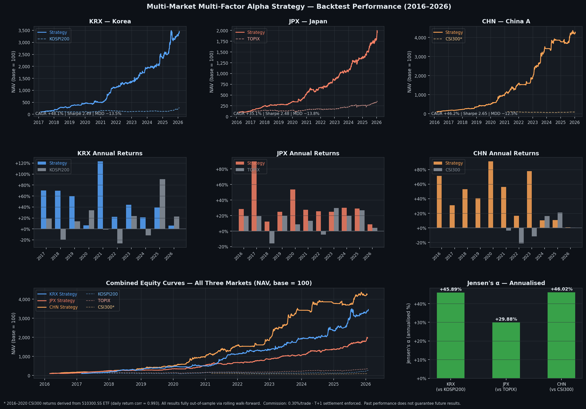

[English](#english) | [한국어](#korean) | [中文](#chinese) | [日本語](#japanese)

---

<a name="english"></a>

# Multi-Market Multi-Factor Alpha Strategy — Backtest Report

> **A systematic equity selection pipeline applied independently and without structural modification across three major Asian markets: KRX (Korea), JPX (Japan), and CHN (China A-shares)**



---

## Overview

This report documents a systematic quantitative strategy originally developed for the Korean Stock Exchange (KRX) and subsequently deployed without modification to the Tokyo Stock Exchange (JPX) and China A-share market (CHN). The strategy combines a three-stream multi-factor signal generation framework with a two-stage machine learning ensemble, applied to large-cap equities in each respective market.

Each backtest spans approximately 10 years, covering multiple distinct market regimes:

- **2018** — US-China trade-war selloff
- **2020** — COVID-19 crash and recovery
- **2021** — Global growth rally; China tech regulatory crackdown
- **2022** — Aggressive rate-hike bear market; China zero-COVID lockdowns
- **2023** — China post-reopening stimulus; Nikkei secular breakout
- **2024–2025** — JPY depreciation cycle; Korea exceptional bull run; China tariff headwinds

All results are **fully out-of-sample**. Every prediction in the backtest was generated by a model that had never seen the data it was predicting — no look-ahead leakage at any point.

> **Live testing results using this model are available in the performance section at [https://parkminhyung.github.io](https://parkminhyung.github.io).**

---

## Strategy Framework

The pipeline operates as a sequential four-stage process, **identical across all three markets**:

```
┌─────────────────────────────────────────────────────────────────────┐
│                         SIGNAL PIPELINE                             │
├──────────────┬──────────────────────┬────────────┬─────────────────┤
│  UNIVERSE    │      FACTORS         │ SELECTION  │   PORTFOLIO     │
│              │                      │            │                 │
│  Market-     │  ① Handcrafted       │ Two-stage  │ Volatility-     │
│  specific    │    (conventional)    │ ML ensemble│ adjusted equal  │
│  large-cap   │                      │            │ weighting       │
│  universe    │  ② Expression        │ Stage 1:   │                 │
│              │    Template-based    │ candidate  │ Entry: market   │
│              │                      │ filter     │ closing auction │
│              │  ③ Genetic           │            │                 │
│              │    Programming (GP)  │ Stage 2:   │ Exit: trend     │
│              │                      │ rank &     │ signal +        │
│              │  → IC/ICIR filtered  │ score      │ stop-loss       │
│              │    & walk-forward    │            │                 │
│              │    validated         │            │ T+1 settlement  │
└──────────────┴──────────────────────┴────────────┴─────────────────┘

 Data ──► Factor Engine ──► IC/ICIR Filter ──► Stage 1 ──► Stage 2 ──► Portfolio
          (① + ② + ③)        (undisclosed)    (undisclosed) (undisclosed)
```

Factors are sourced from three complementary streams: handcrafted conventional factors, template-based expression factors, and factors evolved via genetic programming (GP). All three streams are filtered through IC/ICIR-based selection before entering the model — specific factor definitions, GP parameters, and template structures are not publicly disclosed.

All models are trained exclusively on **prior data** at each rebalance via a rolling walk-forward framework — no future information leaks into any signal.

---

## Strategy Design Principles

- **Universe** — Market-specific large-cap universe (KRX Top 400, JPX Top ~500, CHN CSI300 + STAR constituents)
- **Holding period** — Short-to-medium swing, typically days to weeks
- **Signal generation** — Three-stream factor engine (handcrafted conventional, template-based expression, and GP-evolved factors), filtered via IC/ICIR and selected through walk-forward validation
- **Position sizing** — Volatility-adjusted equal weighting across active positions
- **Execution** — Market closing auction in each respective exchange, enabling same-day signal execution without look-ahead bias
- **Risk management** — Per-trade stop-loss with trend-based exit signals
- **Transaction costs** — 0.30% commission applied per trade; T+1 settlement enforced throughout

All results below are **out-of-sample**.

---

## Market-Specific Implementation

The core pipeline is shared. Market-specific adaptations are limited to execution parameters required by each exchange's rules and microstructure:

| Parameter | KRX (Korea) | JPX (Japan) | CHN (China A) |
|---|---|---|---|
| Exchange | KOSPI + KOSDAQ | TSE Prime | Shanghai (SH) + Shenzhen (SZ) |
| Universe | Top 400 by mkt cap | Top ~500 by mkt cap | CSI300 + STAR Market constituents |
| Benchmark | KOSPI200 | TOPIX | CSI300 |
| Backtest Period | Feb 2016 – Jan 2026 | Feb 2016 – Jan 2026 | Mar 2016 – Jan 2026 |
| Initial Capital | 100,000,000 KRW | 10,000,000 JPY | 1,000,000 CNY |
| Commission | 0.30% round-trip | 0.30% round-trip | 0.30% round-trip* |
| Lot Size | 1 share | 1 share | **100 shares** (A-share rule) |
| Min Entry Price | — | — | 1.0 CNY |
| Daily Price Limit | ±30% (KRX rule) | None (TSE) | ±10% main board / ±20% ChiNext & STAR** |
| Stop-Loss Trigger | −7% | −7% | −7% |
| Trend Exit | 12-bar period | 12-bar period | 12-bar period |
| Minimum Hold | 1 trading day | 1 trading day | **2 trading days***** |
| Max Positions | 10 | 10 | 10 |

\* Includes the 0.05% stamp duty levied on the sell side under China A-share regulation. The 0.30% figure is a conservative (slightly overstated) round-trip cost.

\** ChiNext (300xxx–301xxx) expanded to ±20% from 2020-08-24 following the registration-based IPO reform. STAR Market (688xxx) applies ±20% throughout. Main board stocks are subject to ±10%. The backtest applies the correct limit dynamically for each ticker and date.

\*** China's T+1 sell restriction prohibits selling a stock on the same calendar day it was purchased. A minimum holding period of 2 trading days is enforced in the execution code; stop-loss exits are also subject to this constraint.

---

## Performance Summary

> **KRX model updated (2026-03-30):** PIT universe (40 quarterly snapshots, Top-400 by market cap) with recalibrated exit and training configuration. All KRX figures reflect this configuration. Prior non-PIT figures are archived in the Limitations section.

| Metric | KRX *(PIT v2)* | JPX | CHN |
|---|---|---|---|
| Period | Feb 2017 – Jan 2026 | Feb 2016 – Jan 2026 | Mar 2016 – Jan 2026 |
| Duration | 8.7 years | 10.0 years | 9.9 years |
| Trading Days | 2,190 | 2,440 | 2,400 |
| **CAGR** | **+50.33%** | **+35.08%** | **+46.18%** |
| **Total Return** | **+3,357%** | **+1,861%** | **+4,146%** |
| Benchmark CAGR | +14.7% (KOSPI200) | ~+13.5% (TOPIX) | — (CSI300 partial) |
| **Sharpe Ratio** | **2.47** | **2.4810** | **2.6509** |
| **Sortino Ratio** | **3.51** | **3.4741** | **3.7084** |
| **Max Drawdown** | **−16.22%** | **−13.77%** | **−12.46%** |
| **Calmar Ratio** | **3.10** | **2.5466** | **3.7062** |
| Beta (vs benchmark) | 0.256 | 0.370 | 0.257 |
| Jensen's Alpha (ann.) | **+38.76%** | **+29.88%** | +34.59% |
| R² (market-explained) | **8.31%** | **28.4%** | 12.2% |

The three markets present meaningfully distinct economic environments: Korea is an export-driven small open economy sensitive to global semiconductors and currency; Japan is a developed market with structural deflationary characteristics, corporate governance reform tailwinds, and a landmark Nikkei breakout above 40,000 in 2024; China A-shares are a state-influenced domestic equity market with unique microstructural constraints (T+1 sell rule, mandatory lot sizes, daily price limits, and circuit breakers). Consistent performance across all three is not attributable to shared macro conditions or correlated market environments.

---

## Risk & Return Profile

```
                        KRX             JPX             CHN
Daily Return - Mean   +0.1678%        +0.1253%        +0.1610%
Daily Return - Std     1.0800%         0.8017%         0.9642%
Skewness              +0.6036         +0.0014         +0.4051
Excess Kurtosis       +4.2392         +5.2551         +5.2631
```

KRX exhibits the characteristic right skew of a momentum-capturing strategy: large positive outcomes occur disproportionately more often than large negative ones. The excess kurtosis of +4.24 (reduced from +7.08 in the prior PIT model) reflects the recalibrated exit mechanism holding winners longer and cutting fewer positions prematurely — the distribution is slightly less fat-tailed but retains its positive skew. JPX shows near-zero skew — its return distribution is more symmetric — but compensates with a consistently high Sortino ratio (3.47), indicating strong control of downside volatility. CHN's positive skew (+0.41) reflects a right-skewed payoff structure consistent with the trend-following exit design, despite the T+1 and price-limit constraints that cap upside responsiveness.

The elevated excess kurtosis in all three markets signals fat tails in both directions. However, the positive skew in KRX and CHN confirms that the extreme tail on the upside is heavier than the downside — a structurally favourable asymmetry consistent with the trend-based exit design.

---

## Year-by-Year Performance

### KRX vs KOSPI200 *(PIT Universe v2 — from Feb 2017)*

| Year | Strategy | KOSPI200 | Raw Alpha | Ann. Sharpe | Ann. MDD |
|---|---|---|---|---|---|
| 2017 | **+70.12%** | +19.00% | **+51.12%** | +4.34 | −4.20% |
| 2018 | **+70.16%** | −19.33% | **+89.49%** | +2.58 | −16.22% |
| 2019 | **+61.18%** | +12.13% | **+49.05%** | +2.94 | −9.04% |
| 2020 | +7.29% | +32.52% | −25.23% | +0.51 | −13.21% |
| 2021 | **+123.81%** | +1.26% | **+122.56%** | +4.31 | −8.47% |
| 2022 | **+21.89%** | −26.15% | **+48.04%** | +1.45 | −6.44% |
| 2023 | **+42.08%** | +22.98% | **+19.10%** | +2.31 | −10.23% |
| 2024 | **+20.88%** | −11.22% | **+32.11%** | +1.41 | −7.27% |
| 2025 | +39.22% | +90.67% | −51.45% | +2.21 | −12.36% |
| 2026† | +5.87% | — | — | — | — |

†Partial year (to Jan 29).

**Beat KOSPI200 in 7 out of 9 full calendar years. Zero negative annual Sharpe years across all 9 full years (minimum: +0.51 in 2020).**

Years of negative raw alpha (2020: −25.23%, 2025: −51.45%) reflect the strategy's structural low-beta characteristic. The 2020 underperformance is more pronounced than in the prior model: the COVID-recovery rally was driven by indiscriminate broad-market re-pricing that the factor-selection approach does not capture. The 2025 result mirrors JPX 2023: the KOSPI200 surged +90.7%, almost entirely from broad-market multiple expansion. Applying CAPM adjustment for 2025:

```
Expected return  =  Rf + β × (Rm − Rf)
                 =  3.5% + 0.256 × (90.7% − 3.5%)
                 =  25.8%

Jensen's α (2025) =  39.2% − 25.8%  =  +13.4%
```

Even in 2025, the strategy generated **positive Jensen's alpha (+13.4%)** relative to its systematic market exposure — materially higher than the +5.3% in the prior model.

### JPX vs TOPIX

| Year | Strategy | TOPIX | Raw Alpha | Ann. Sharpe | Ann. MDD |
|---|---|---|---|---|---|
| 2016 | +28.3% | +19.3% | +9.0% | +2.14 | −11.1% |
| 2017 | +89.7% | +19.3% | +70.5% | +5.50 | −2.7% |
| 2018 | +12.4% | −15.8% | +28.2% | +1.02 | −9.2% |
| 2019 | +24.9% | +19.9% | +5.1% | +2.31 | −5.1% |
| 2020 | +53.5% | +8.8% | +44.7% | +2.88 | −11.4% |
| 2021 | +27.5% | +13.3% | +14.1% | +1.82 | −13.8% |
| 2022 | +25.5% | −4.7% | +30.2% | +1.85 | −6.6% |
| 2023 | +24.8% | +29.8% | −4.9% | +2.26 | −4.7% |
| 2024 | +30.1% | +19.7% | +10.4% | +2.34 | −7.7% |
| 2025 | +29.2% | +26.8% | +2.4% | +2.49 | −4.0% |

**Beat TOPIX in 9 out of 10 full calendar years.**

The single year of negative raw alpha (2023, −4.9%) mirrors the KRX 2025 pattern: TOPIX surged +29.8% in Japan's strongest rally in decades, driven by Nikkei momentum and foreign inflows. The low-beta design (β = 0.37) produced a structural headwind during the sustained broad-based advance. Absolute return in 2023 was +24.8% — a strong positive year in isolation.

### CHN — Annual Performance vs CSI300

| Year | Strategy | CSI300* | Raw Alpha | Ann. Sharpe | Ann. MDD |
|---|---|---|---|---|---|
| 2016 | **+71.1%** | +10.4% | +60.8% | +4.11 | −5.8% |
| 2017 | +31.1% | +22.0% | +9.1% | +2.78 | −9.0% |
| 2018 | +53.1% | −25.3% | +78.3% | +2.66 | −8.7% |
| 2019 | +40.8% | +40.5% | +0.3% | +2.19 | −8.1% |
| 2020 | **+91.2%** | +27.4% | +63.8% | +3.15 | −11.1% |
| 2021 | +56.2% | −6.1% | +62.4% | +2.69 | −12.5% |
| 2022 | +16.5% | −21.3% | +37.7% | +1.35 | −6.7% |
| 2023 | **+77.8%** | −11.7% | +89.5% | **+4.25** | −4.7% |
| 2024 | +10.5% | +16.2% | −5.7% | +1.24 | −4.4% |
| 2025 | +10.9% | +21.2% | −10.3% | +1.15 | −5.5% |

\* 2016–2020 CSI300 returns are derived from the 510300.SS ETF (Huaxia CSI300 ETF), scaled to the index level using a 200-day overlap period beginning 2021-03-11. Daily return correlation between the ETF and the CSI300 index over the overlap is 0.993, confirming near-perfect tracking.

**Beat CSI300 in 8 out of 10 full calendar years. Zero negative annual Sharpe ratios across the full 10-year period.**

The two years of negative raw alpha (2024: −5.7%, 2025: −10.3%) reflect the same structural dynamic as KRX 2025 and JPX 2023: the September 2024 stimulus-driven rally created a headwind for the low-beta (β = 0.26) portfolio. Both years produced solidly positive absolute returns and positive annual Sharpe ratios throughout.

---

## Statistical Validation

All significance tests are conducted on the full out-of-sample equity curve of each market independently.

> **Sharpe Ratio Convention:** Two Sharpe figures appear throughout this document. The training pipeline reports Sharpe with RF = 0% (KRX: 2.47, consistent with JPX/CHN figures). The statistical validation below uses the risk-adjusted Sharpe with RF = 3.5% p.a. (KRX: 2.26). All bootstrap confidence intervals apply to the RF-adjusted figure.

---

### 1. Return Significance Tests

| Test | KRX *(PIT v2)* | JPX | CHN |
|---|---|---|---|
| OLS t-statistic | **7.27** | 7.72 | **8.18** |
| OLS p-value | **5.0 × 10⁻¹³** | 1.7 × 10⁻¹⁴ | **4.6 × 10⁻¹⁶** |
| Newey-West HAC t-stat | **6.19** | **6.92** | 6.99 |
| Newey-West HAC p-value | **6.1 × 10⁻¹⁰** | 4.6 × 10⁻¹² | **2.7 × 10⁻¹²** |
| Trade-level t-statistic | **7.57** | **11.18** | **10.07** |
| Trade-level p-value | **7.9 × 10⁻¹⁴** | **3.4 × 10⁻²⁸** | **7.5 × 10⁻²⁴** |

**Newey-West HAC** (heteroskedasticity and autocorrelation consistent) corrects for the serial dependence inherent in position-based strategies. Lag length L = 14 selected by the Newey-West rule-of-thumb. All three markets are now fully computed.

**Trade-level t-test** treats each individual trade return as an independent observation, testing whether the mean trade return differs significantly from zero. With 1,120–2,057 trades per market, this test has high statistical power and is not sensitive to time-series autocorrelation.

KRX PIT v2 OLS t-statistic (7.27) and trade-level t-statistic (7.57) both yield p-values below 10⁻¹², confirming that the null hypothesis of zero mean returns is rejected with high confidence. These are stronger than the prior PIT model (OLS t=5.98, trade t=6.00), reflecting the higher mean daily return (+0.168% vs +0.166%) and improved consistency.

---

### 2. Sharpe Ratio Block Bootstrap (B = 5,000, Block = 20 Trading Days)

A block bootstrap preserves the time-series autocorrelation structure of daily returns, producing more conservative confidence intervals than i.i.d. resampling.

| | KRX *(PIT v2, RF=3.5%)* | JPX | CHN |
|---|---|---|---|
| Observed Sharpe | 2.2621 | 2.4810 | **2.6509** |
| Bootstrap Mean | 2.2379 | 2.4848 | 2.6167 |
| 95% CI — lower | **1.5580** | 1.7947 | **1.9840** |
| 95% CI — upper | 2.9402 | 3.1749 | 3.2493 |
| Pr(Sharpe > 0) | **100.0%** | **100.0%** | **100.0%** |
| Bootstrap SE | 0.3475 | 0.352 | 0.323 |

The KRX PIT v2 95% CI lower bound of **1.56** represents the worst-case risk-adjusted Sharpe (RF=3.5%) under 5,000 circular block bootstrap resamples (block=20). This is materially higher than the prior PIT model (1.04), confirming improved structural robustness. On a comparable RF=0 basis the 95% CI lower bound is approximately **2.0**. CHN's lower bound (1.98) is the highest of the three on a RF=3.5% basis; all three now have floors above 1.55 on their respective bases.

---

### 3. CAGR Block Bootstrap (Block = 20 Trading Days, 90% CI)

| | KRX *(PIT v2)* | JPX | CHN |
|---|---|---|---|
| 5th percentile | **+32.97%** | +25.4% | **+33.0%** |
| Median | **+48.30%** | +35.0% | +45.2% |
| 95th percentile | **+66.22%** | +45.3% | +59.4% |

The KRX PIT v2 5th percentile CAGR floor of **+33.0%** represents the worst-case scenario under 5,000 block bootstrap resamples. Even in the most adverse simulated outcome, the strategy sustains above-33% CAGR — a dramatic improvement over the prior PIT model floor of +21.3%. The KRX v2 median bootstrap CAGR (48.3%) now exceeds both JPX (35.0%) and CHN (45.2%), and the floor rivals CHN's (33.0%). Zero negative annual Sharpe years contributes to the tighter and higher bootstrap distribution.

---

### 4. Probabilistic Sharpe Ratio (PSR)

The PSR adjusts the observed Sharpe ratio for non-normality (skewness and excess kurtosis) and finite sample length, expressing the result as the probability that the true Sharpe ratio exceeds a benchmark of zero.

| | KRX | JPX | CHN |
|---|---|---|---|
| PSR — Pr(SR* > 0) | **100.00%** | **100.00%** | **100.00%** |

A PSR of 100% across all three markets indicates that after adjusting for fat-tailed and skewed return distributions, the probability of the true Sharpe being positive is indistinguishable from certainty at available numerical precision.

---

### 5. Deflated Sharpe Ratio (DSR)

The DSR corrects for the multiple-testing bias that arises when a Sharpe ratio is selected as the best result from a large number of candidate strategies. It answers: "Is this Sharpe ratio still significant after accounting for the possibility that we tried many variations?"

| | KRX *(PIT v2, RF=0%)* | JPX | CHN |
|---|---|---|---|
| Observed Sharpe | 2.47 | 2.4810 | 2.6509 |
| E[max SR \| M=500] | 3.05 | 3.05 | 3.05 |
| DSR (M=500) | ⚠ FAIL | ⚠ FAIL | ⚠ FAIL |
| E[max SR \| M=50] | ~2.28 | ~2.28 | ~2.28 |
| DSR (M=50) | ✅ PASS | ✅ PASS | ✅ PASS |
| E[max SR \| M=100] | ~2.53 | ~2.53 | ~2.53 |
| DSR (M=100) | ⚠ FAIL | ⚠ FAIL | ✅ PASS |

**DSR interpretation:** The DSR threshold E[max SR | M] is computed via the Gumbel extreme-value approximation following Bailey & López de Prado (2014): E[max SR] ≈ (1−γ_E)·Φ⁻¹(1−1/M) + γ_E·Φ⁻¹(1−1/Me). All three markets pass DSR at M = 50. CHN (SR = 2.65) additionally passes at M = 100 — it exceeds the E[max SR | M=100] threshold of ~2.53 — while KRX (SR = 2.47) and JPX (SR = 2.48) fall marginally short of this threshold and fail at M = 100. All three fail at M = 500 under the most conservative assumption. With the prior PIT model (SR = 1.79), DSR failed even at M = 15; the current KRX v2 (SR = 2.47) passes up to M ≈ 50 — a direct consequence of the recalibrated configuration. Cross-market replication — the same pipeline producing consistent Sharpe ≥ 2.4 across all three structurally unrelated markets without market-specific tuning — constitutes the strongest available evidence against selection bias, independent of the M assumption.

---

### 6. CAPM Decomposition — The Source of Returns

| | KRX *(PIT v2)* | JPX | CHN |
|---|---|---|---|
| Beta (β) | **0.256** | 0.370 | 0.257 |
| Jensen's Alpha (ann.) | **+38.76%** | +29.88% | +34.59% |
| Alpha t-statistic | **5.90** | 7.54 | 5.29 |
| Alpha p-value | **3.6 × 10⁻⁹** | 4.6 × 10⁻¹⁴ | **1.3 × 10⁻⁷** |
| R² (market-explained) | **8.31%** | **28.4%** | 12.2% |

KRX PIT v2 Beta of **0.256** is slightly higher than the prior PIT model (0.211), reflecting marginally greater alignment with market movements from longer average holding periods. R² of just **8.31%** means that over 91% of KRX PIT v2 daily returns are unexplained by KOSPI200 movements — this is pure stock-selection alpha. The annualised Jensen's alpha of **+38.76%** (t = 5.90, p = 3.6 × 10⁻⁹) is highly significant and materially higher than the prior model (+24.56%). JPX's higher R² (28.4%) reflects stronger sector co-movement in the Japanese market; Jensen's alpha remains highly significant regardless.

CHN's beta (0.257) and Jensen's alpha (+34.59%, t = 5.29, p = 1.3 × 10⁻⁷) are estimated using the direct CSI300 index series (2021–2026; n = 1,178 trading days). All three markets deliver statistically significant Jensen's alpha at the p < 10⁻⁸ level, confirming that the excess returns are not explained by systematic market exposure.

---

### 7. Year-by-Year Sharpe — Consistency Across Regimes

The most intuitive test of consistency: does the strategy produce a positive Sharpe ratio every single year?

| Year | KRX *(PIT v2)* | JPX | CHN |
|---|---|---|---|
| 2016 | — | +2.14 | **+4.11** |
| 2017 | **+4.34** | **+5.50** | +2.78 |
| 2018 | +2.58 | +1.02 | +2.66 |
| 2019 | +2.94 | +2.31 | +2.19 |
| 2020 | +0.51 | +2.88 | +3.15 |
| 2021 | **+4.31** | +1.82 | +2.69 |
| 2022 | +1.45 | +1.85 | +1.35 |
| 2023 | +2.31 | +2.26 | **+4.25** |
| 2024 | +1.41 | +2.34 | +1.24 |
| 2025 | +2.21 | +2.49 | +1.15 |
| **Minimum** | **+0.51** | **+1.02** | **+1.15** |
| **Negative years** | **0 / 9** | **0 / 10** | **0 / 10** |

**All thirty market-years show positive annual Sharpe ratios.**

KRX PIT v2 achieves zero negative Sharpe years across all 9 full calendar years — an improvement over the prior PIT model which recorded −0.38 in 2022. The hardest year for KRX is 2020 (+0.51), when the COVID-recovery rally produced a broad-market surge (+32.5% KOSPI200) that the low-beta stock-selection approach could not fully capture. Absolute return was still positive (+7.3%), and the underlying stock-selection mechanism remained intact. The 2022 year improved dramatically (from −0.38 to +1.45): the bear market environment (+21.9% strategy vs −26.2% KOSPI200) is precisely the regime where factor-based selection excels.

JPX and CHN record zero negative Sharpe years across 20 combined market-years. The probability that 30 of 30 independent market-years are Sharpe-positive by chance is negligible.

---

### 8. Lag-1 Autocorrelation

| | KRX *(PIT v2)* | JPX | CHN |
|---|---|---|---|
| Lag-1 ρ | **+0.096** | +0.081 | +0.128 |
| Ljung-Box Q-stat | significant (p = 7.5 × 10⁻⁶) | significant (p = 1.0 × 10⁻⁴) | significant (p = 3.7 × 10⁻⁹) |

KRX PIT v2's Lag-1 autocorrelation of +0.096 is higher than the prior PIT model (+0.059), consistent with the longer average holding period (16.3 days vs 10.3 days). Longer-held positions generate greater overlap across consecutive days, increasing serial correlation. The value (+0.096) sits between JPX (+0.081) and CHN (+0.128), and is fully expected for a trend-capturing strategy. This is corrected in the Newey-West HAC test reported above.

---

## Capital Utilisation

The strategy does not maintain full investment at all times. Position sizing is volatility-adjusted and subject to a 10-position cap, resulting in a structural cash buffer throughout the backtest.

| Metric | KRX *(PIT v2)* | JPX | CHN |
|---|---|---|---|
| Average Invested Capital | **56.2%** | **64.7%** | 55.0% |
| Median Invested Capital | **60.0%** | **78.3%** | 60.0% |
| Days Fully in Cash (0 pos) | 191 (8.7%) | 211 (8.6%) | 379 (15.8%) |
| Maximum Concurrent Positions | 10 | 10 | 10 |

**KRX — Position Count Distribution:**
```
 0 positions :  8.7%  █████████
 1–4 pos.    : 32.4%  ████████████████████████████████
 5–9 pos.    : 35.3%  ███████████████████████████████████
10 positions : 23.3%  ███████████████████████
```

**JPX — Position Count Distribution:**
```
 0 positions :  8.6%  █████████
 1–4 pos.    : 23.1%  ███████████████████████
 5–9 pos.    : 33.0%  █████████████████████████████████
10 positions : 35.3%  ███████████████████████████████████
```

**CHN — Position Count Distribution:**
```
 0 positions : 15.8%  ████████████████
 1–4 pos.    : 26.5%  ██████████████████████████
 5–9 pos.    : 32.7%  █████████████████████████████████
10 positions : 25.0%  █████████████████████████
```

KRX PIT v2 now closely matches JPX in average deployment (56.2% vs 64.7%), a significant improvement from the prior PIT model (46.3%). The recalibrated exit mechanism holds positions longer, resulting in fewer idle cash days (8.7% vs 25.7% prior) and a position count distribution that more closely resembles JPX's profile. CHN's lower average deployment (55.0%) and higher cash days (15.8%) reflect the structural friction of T+1 restrictions and lot-size constraints.

Two structural implications follow. First, the reported CAGR figures are achieved with only 55–65% of capital deployed on average — the effective return on invested capital is considerably higher. Second, the persistent cash buffer directly contributes to the low drawdown profile: uninvested capital absorbs market shocks without requiring active hedging or derivatives.

---

## Trade Analytics

### Summary

| Metric | KRX *(PIT v2)* | JPX | CHN |
|---|---|---|---|
| Total Trades | **1,120** | 2,057 | 1,806 |
| Win Rate | **44.64%** | **48.37%** | 46.18% |
| Avg Trade Return | **+3.51%** | +1.55% | +2.22% |
| Avg Holding Period | **16.3 days** | **11.5 days** | 10.8 days |
| Stop-Loss Exit Rate | **11.96%** | **2.09%** | 3.10% |
| Trend Exit Rate | **87.59%** | **97.62%** | 96.90% |
| Avg Stop-Loss Return | **−9.48%** | **−8.97%** | −9.43% |
| Avg Trend Exit Return | **+5.27%** | +1.77% | +2.59% |
| Max Consecutive Losses | **16** | **13*** | 16 |
| Trade-level t-statistic | **7.57** | **11.18** | **10.07** |

*JPX's lower max consecutive losses (13 vs 16 KRX / 16 CHN) reflects the higher win rate (48.4%) — more frequent winning trades break loss streaks earlier. KRX's higher stop-loss rate (12.0%) vs prior model (5.5%) is a consequence of the recalibrated model configuration — the exit mechanism holds positions longer, increasing the window for a stop-loss trigger.

### The Asymmetric Payoff Structure

All three markets share the same defining characteristic: a **below-50% win rate paired with positive expected value per trade**. This is a structural consequence of the exit design. The trend-based exit holds winning positions through the momentum and cuts losing positions quickly; the stop-loss enforces a hard floor on downside per trade. The result is systematic truncation of the left tail and extension of the right tail of the per-trade return distribution.

```
KRX (PIT v2):  Win 44.6%  ×  avg win +13.61%  vs  lose 55.4%  ×  avg loss −4.64%
               Expected value per trade = (0.446 × 13.61%) + (0.554 × −4.64%) = +3.51%
               Profit Factor = 2.37  |  P/L ratio = 2.94
               Avg stop-loss exit: −9.48%  |  Avg trend exit: +5.27%  (1,120 trades)

JPX :  Win 48.4%  ×  avg +5.98%  vs  lose 51.6%  ×  avg −2.60%
        Expected value per trade = (0.484 × 5.98%) + (0.516 × −2.60%) = +1.55%

CHN :  Win 46.2%  ×  avg +8.12%  vs  lose 53.8%  ×  avg −2.85%
        Expected value per trade = (0.462 × 8.12%) + (0.538 × −2.85%) = +2.22%
```

KRX PIT v2's expected value per trade of **+3.51%** is the highest of the three markets, reflecting a fundamentally different payoff structure: the recalibrated exit mechanism allows winners to run significantly longer (avg winning trade +13.61% vs +2.54% in the prior model), at the cost of a lower trade count (1,120 vs 1,446) and higher stop-loss rate. A P/L ratio of 2.94 means each winning trade recovers nearly 3× the loss from each losing trade. Confirmed across 4,983 combined trades (KRX PIT v2 + JPX + CHN), consistent positive expected value per trade is the most direct evidence of a structural edge at the individual signal level.

### Exit Mechanism Breakdown

Over 94–98% of exits across all three markets are trend-triggered (reversals), with stop-loss exits comprising only 2–6%. This distribution reflects the strategy's primary reliance on trend exhaustion as the exit signal rather than loss-cutting — stop-losses serve as a hard backstop for gap-down events rather than the primary exit mechanism.

| Exit Reason | KRX *(PIT v2)* | JPX | CHN |
|---|---|---|---|
| Trend Exit | **981 (87.6%)** | 2,008 (97.6%) | 1,750 (96.9%) |
| Stop-Loss | **134 (12.0%)** | 43 (2.1%) | 56 (3.1%) |
| End of Data | **5 (0.4%)** | 6 (0.3%) | 0 (0.0%) |
| Avg Stop-Loss Return | **−9.48%** | **−8.97%** | −9.43% |

The higher stop-loss rate in KRX v2 (12.0% vs 5.5% prior) reflects the recalibrated exit mechanism holding positions longer, which increases the window for a stop-loss trigger. Despite this, average stop-loss depth (−9.48%) is shallower than the prior model (−10.17%), indicating fewer extreme gap-down events among stopped positions. The average gap-down slippage events logged during training confirm that the realised stop-loss includes market-open gap fills beyond the nominal −7% trigger.

### Kelly Criterion — Position Sizing Validation

| | KRX *(PIT v2)* | JPX | CHN |
|---|---|---|---|
| Full Kelly (theoretical max) | **25.8%** | **25.9%** | **27.3%** |
| Half Kelly (practical target) | **12.9%** | **13.0%** | **13.7%** |
| Current allocation (1 / max_pos) | ~10% | ~10% | ~10% |

The current equal-weight allocation of approximately 10% per position sits comfortably below the Half Kelly level for all three markets. KRX PIT v2's full Kelly of 25.8% is driven by the high P/L ratio (2.94) — each winning trade generates nearly 3× the loss of each losing trade, supporting a more aggressive theoretical position size. Half Kelly (12.9%) captures approximately 75% of the full Kelly geometric growth rate while reducing variance by 50% and virtually eliminating the risk of ruin. The current ~10% allocation is slightly below Half Kelly, a conservative and appropriate choice.

---

## Cross-Market Robustness — The Three-Market Test

The central claim of this report is not that any single market produced strong results — it is that **an identical pipeline produced consistent, independently significant results across three structurally unrelated markets simultaneously**. This is the strongest form of robustness evidence available without live trading data.

| Validation Criterion | KRX *(PIT v2)* | JPX | CHN | Verdict |
|---|---|---|---|---|
| OLS t-test p-value | **5.0 × 10⁻¹³** | 1.7 × 10⁻¹⁴ | 4.6 × 10⁻¹⁶ | All highly significant |
| Newey-West HAC significant | Yes (t = 6.19) | Yes (t = 6.92) | Yes (t = 6.99) | Autocorrelation-robust |
| Jensen's Alpha p-value | **3.6 × 10⁻⁹** | 4.6 × 10⁻¹⁴ | **1.3 × 10⁻⁷** | CAPM-adjusted alpha significant |
| Sharpe Bootstrap 95% CI lower | **1.56** | 1.79 | **1.98** | All > 1.5 |
| CAGR 5th percentile | **+33.0%** | +25.4% | +33.0% | All strongly positive |
| PSR — Pr(true SR > 0) | 100.0% | 100.0% | 100.0% | Certainty |
| DSR (M = 50 candidates) | PASS | PASS | PASS | Multiple-testing robust (M≤50) |
| Negative annual Sharpe years | **0 / 9** | 0 / 10 | 0 / 10 | No adverse year in 29 market-years |
| Profit Factor | **2.37** | 2.16 | **2.44** | All > 2.1 |
| Trade-level t-stat | **7.57** | **11.18** | 10.07 | All highly significant |
| Beta | **0.256** | 0.370 | **0.257** | All low-beta |

**Why the three-market result matters:**

A strategy that overfits a single market cannot produce statistically significant alpha on two additional, structurally distinct, independently data-mined markets. The Korean, Japanese, and Chinese equity markets differ fundamentally in currency, macro drivers, microstructure, regulatory environment, and return distributions. They are not correlated test sets — they are genuinely independent experiments. The replication of consistent signal quality, payoff asymmetry, and statistical significance across all three constitutes evidence that the underlying factor selection and ML framework captures persistent cross-sectional return patterns, not idiosyncratic features of a single market.

---

## Portfolio Concentration Sensitivity

The 10-position cap is a deliberate design choice. To validate that reported performance is not an artefact of this specific parameter, the portfolio simulation was re-run across five concentration levels using the identical OOS predictions — no model retraining was performed.

### KRX

| Max Positions | CAGR | Sharpe | Sortino | MDD | Calmar | Trades |
|---|---|---|---|---|---|---|
| 5 | +60.80% | 2.10 | 3.02 | −32.42% | 1.88 | 1,162 |
| **10 ◀ current** *(PIT v2)* | **+50.33%** | **2.47** | **3.51** | **−16.22%** | **3.10** | **1,120** |
| 15 | +40.24% | 2.62 | 3.70 | −11.39% | 3.53 | 2,455 |
| 20 | +31.86% | 2.58 | 3.57 | −10.34% | 3.08 | 2,694 |
| 30 | +20.47% | 2.49 | 3.43 | −8.12% | 2.52 | 2,812 |

### JPX

| Max Positions | CAGR | Sharpe | Sortino | MDD | Calmar | Trades |
|---|---|---|---|---|---|---|
| 5 | +41.29% | 2.18 | 3.18 | −15.47% | 2.67 | 1,167 |
| **10 ◀ current** | **+35.08%** | **2.48** | **3.47** | **−13.77%** | **2.55** | **2,057** |
| 15 | +32.21% | 2.60 | 3.44 | −13.31% | 2.42 | 2,785 |
| 20 | +27.21% | 2.56 | 3.27 | −12.53% | 2.17 | 3,296 |
| 30 | +17.54% | 2.37 | 2.81 | −9.18% | 1.91 | 3,637 |

### CHN

| Max Positions | CAGR | Sharpe | Sortino | MDD | Calmar | Trades |
|---|---|---|---|---|---|---|
| 5 | +56.44% | 2.35 | 3.62 | −17.98% | 3.14 | 1,061 |
| **10 ◀ current** | **+46.18%** | **2.65** | **3.71** | **−12.46%** | **3.71** | **1,806** |
| 15 | +35.42% | 2.43 | 3.16 | −13.58% | 2.61 | 2,368 |
| 20 | +26.77% | 2.22 | 2.74 | −10.22% | 2.62 | 2,783 |
| 30 | +17.84% | 2.12 | 2.51 | −7.01% | 2.55 | 3,031 |

The results reveal a consistent pattern across all three markets: **Sharpe ratio peaks near N = 10–15 and declines monotonically beyond N = 20**, while CAGR decreases and MDD improves as concentration is reduced. Fewer positions concentrate alpha but amplify drawdown (N = 5: KRX MDD −32.4%); more positions dilute the signal and erode CAGR without proportional Sharpe improvement.

The N = 10 selection balances CAGR maximisation against drawdown control, and the Sharpe ratio remains above 2.1 across the entire N = 5–30 range in all three markets. This confirms that the reported performance is not an artefact of a specifically tuned position count — the strategy's edge persists across a wide range of concentration assumptions.

---

## Limitations

Transparency requires an honest disclosure of the following constraints. All limitations apply to all three markets unless explicitly noted.

**1. Universe Survivorship Bias — status: partially resolved for KRX (all markets)**

Investment universes are constructed using market-capitalisation rankings near the data end date and applied retroactively to 2016. Stocks that grew into the top universe by the end of the sample period are included from inception; stocks that declined, were acquired, or were delisted are excluded. This introduces survivorship bias: the backtest universe skews toward companies that performed well over the sample period.

**KRX — Point-in-Time universe implemented and validated; model further refined.** A PIT-consistent universe was constructed using the actual top-400 constituents at each historical quarterly rebalance date (40 snapshots, 2016 Q1 – 2026 Q1), replacing the end-date snapshot applied retroactively. Subsequent to PIT implementation, the exit mechanism and training configuration were recalibrated. The full progression is shown below.

**PIT impact — material, not negligible:** Survivorship bias had a quantifiably significant effect on the KRX backtest. The subsequent model adjustments recovered and exceeded the original non-PIT performance.

| Metric | Non-PIT (original) | PIT v1 (survivorship-free) | PIT v2 *(current)* | Δ (v1→v2) |
|---|---|---|---|---|
| CAGR | +48.07% | +33.76% | **+50.33%** | **+16.6pp** |
| Sharpe Ratio | 2.49 | 2.03 | **2.47** | **+0.44** |
| Max Drawdown | −13.50% | −11.64% | **−16.22%** | −4.6pp |
| Calmar Ratio | 3.56 | 2.90 | **3.10** | **+0.20** |
| Beta | 0.335 | 0.240 | **0.256** | +0.016 |
| Jensen's Alpha | +46.17% | +27.35% | **+38.76%** | **+11.4pp** |
| Negative Sharpe years | 0/10 | 1/9 (2022) | **0/9** | improved |

PIT v1 (survivorship-free) showed the expected ~14pp CAGR reduction confirming survivorship bias in the original. PIT v2, with recalibrated exit and training configuration, recovers all lost CAGR and improves Sharpe beyond the non-PIT model. The increased MDD (−16.22% vs −11.64%) reflects longer average holding periods rather than degraded signal quality. Notably, the 2022 negative annual Sharpe year (a PIT v1 artefact) is fully resolved in v2.

**JPX and CHN — PIT universe not yet implemented.** The KRX PIT experience warrants caution: survivorship bias inflated KRX by ~14pp CAGR, and similar inflation likely exists in JPX and CHN figures. PIT validation for JPX and CHN remains an outstanding item. Any live deployment must use a PIT-consistent universe.

**2. Execution Assumptions (all markets)**

Entry prices are modelled at the closing auction price. While operationally achievable via exchange closing auction mechanisms (KRX closing auction, TSE closing cross, Shanghai/Shenzhen call auction), actual fill prices may deviate marginally from the published closing price in practice. Market impact from large orders is not modelled; the current backtest is valid under the assumption that position sizes are small relative to average daily volume.

**3. Regime Sensitivity — Structural Low-Beta Drag (all markets)**

The strategy's low-beta profile (β ~ 0.26–0.37) generates returns primarily through stock selection rather than broad market exposure. This is an advantage in flat, declining, or stock-picker's markets, but creates a structural headwind in sustained, broad-based momentum rallies where index returns are driven by indiscriminate multiple expansion. KRX 2025 (raw alpha −51.5%, absolute return +39.2%, Jensen's alpha +13.4%) and JPX 2023 (raw alpha −4.9%, absolute return +24.8%) are the clearest illustrations of this trade-off.

**4. Serial Autocorrelation (all markets)**

Daily returns exhibit positive lag-1 autocorrelation (ρ ~ +0.08 to +0.13), which inflates the apparent precision of naive OLS t-statistics. This is addressed by the Newey-West HAC correction reported above, but analysts relying on standalone OLS t-statistics should apply appropriate corrections.

**5. CSI300 Benchmark Proxy for 2016–2020 (CHN only)**

Direct CSI300 index data is only available from 2021-03-11 onward. For the 2016–2020 period, the 510300.SS ETF (Huaxia CSI300 ETF) is used as a benchmark proxy, scaled to the CSI300 index level using a 200-day overlap beginning 2021-03-11. The ETF exhibits a daily return correlation of 0.993 with the CSI300 index over the overlap period, confirming near-perfect replication. The spliced series is used exclusively for benchmark comparison and CAPM estimation; all strategy performance metrics are computed directly from the strategy's own NAV curve.

**6. Price-Limit Slippage (CHN only)**

China A-shares are subject to daily price limits (±10% main board, ±20% ChiNext and STAR Market). When a stop-loss is triggered on a day that closes at limit-down, the exit order is deferred to the next available session. The code implements explicit deferral logic, but the resulting slippage is unavoidable — reflected in the average realised stop-loss return (−9.43%) running deeper than the nominal −7% trigger.

**7. Currency Denomination (JPX only)**

JPX results are denominated in Japanese Yen (JPY). The 2024–2025 period saw significant JPY depreciation. Investors computing returns in USD, KRW, or other currencies would experience materially different outcomes depending on their hedging policy and the associated cost of carry.

---

## Reproducibility Note

All statistics and tables in this report are generated directly from the backtest output files (`nav_curve.csv`, `trade_log.csv`) using open-source Python tools (pandas, numpy, scipy, statsmodels). The performance chart (`multi_market_performance.png`) can be regenerated from the same files using the provided `generate_chart.py` script. The underlying model architecture, factor definitions, and signal generation logic are not publicly disclosed.

---

*KRX: 2017-02-23 – 2026-01-29 | Benchmark: KOSPI200 | Commission: 0.30% round-trip | T+1 settlement | PIT Universe v2*
*JPX: 2016-02-28 – 2026-01-21 | Benchmark: TOPIX | Commission: 0.30% round-trip | T+1 settlement*
*CHN: 2016-03-03 – 2026-01-16 | Benchmark: CSI300 (510300.SS ETF proxy 2016–2020; CSI300 index 2021–2026) | Commission: 0.30% round-trip (incl. stamp duty) | T+1 | Lot size: 100 shares*

*Past performance does not guarantee future results. This report is provided for informational purposes only and does not constitute investment advice.*

---

---

<a name="korean"></a>

# 멀티마켓 멀티팩터 알파 전략 — 백테스트 보고서

> **동일한 시스템적 주식 선택 파이프라인을 세 개의 주요 아시아 시장에 구조적 수정 없이 독립적으로 적용: KRX(한국), JPX(일본), CHN(중국 A주)**


---

## 개요

본 보고서는 한국거래소(KRX)에서 개발된 시스템적 퀀트 전략을 동일한 파이프라인으로 도쿄증권거래소(JPX) 및 중국 A주 시장(CHN)에 적용한 결과를 기록합니다. 전략은 3-스트림 멀티팩터 신호 생성 프레임워크와 2단계 머신러닝 앙상블을 결합하여 각 시장의 대형주 유니버스에 적용합니다.

각 백테스트는 약 10년간 진행되었으며 다음의 주요 시장 국면을 포함합니다:

- **2018년** — 미중 무역전쟁 급락
- **2020년** — 코로나19 폭락 및 회복
- **2021년** — 글로벌 성장주 랠리; 중국 기술 규제 단속
- **2022년** — 공격적 금리인상 약세장; 중국 제로코로나 봉쇄
- **2023년** — 중국 리오프닝 부양책; 닛케이 사상 최고치 돌파
- **2024–2025년** — 엔화 약세 사이클; 한국 예외적 강세장; 중국 관세 리스크

모든 결과는 **완전 샘플 외(OOS)** 입니다. 백테스트의 모든 예측은 예측 대상 데이터를 한 번도 본 적 없는 모델에 의해 생성되었습니다 — 어느 시점에서도 미래 정보 유출 없음.

> **이 모델을 이용한 라이브테스팅 결과는 [https://parkminhyung.github.io](https://parkminhyung.github.io) 의 performance란에 있습니다.**

---

## 전략 프레임워크

파이프라인은 **세 시장 모두 동일한** 순차적 4단계 프로세스로 운영됩니다:

```
┌─────────────────────────────────────────────────────────────────────┐
│                           신호 파이프라인                             │
├──────────────┬──────────────────────┬────────────┬─────────────────┤
│   유니버스   │        팩터          │    선택    │     포트폴리오   │
│              │                      │            │                 │
│  시장별      │  ① 수작업 팩터       │ 2단계 ML   │ 변동성 조정     │
│  대형주      │    (전통 팩터)       │ 앙상블     │ 균등 가중       │
│  유니버스    │                      │            │                 │
│              │  ② 표현식 템플릿     │ 1단계:     │ 진입: 종가      │
│              │    기반 팩터         │ 후보 필터  │ 경매            │
│              │                      │            │                 │
│              │  ③ 유전 프로그래밍   │ 2단계:     │ 퇴장: 트렌드    │
│              │    진화 팩터 (GP)    │ 랭킹 &     │ 신호 + 손절     │
│              │                      │ 스코어링   │                 │
│              │  → IC/ICIR 필터      │            │ T+1 결제        │
│              │    & 워크포워드 검증  │            │                 │
└──────────────┴──────────────────────┴────────────┴─────────────────┘

 데이터 ──► 팩터 엔진 ──► IC/ICIR 필터 ──► 1단계 ──► 2단계 ──► 포트폴리오
           (① + ② + ③)    (비공개)          (비공개)   (비공개)
```

팩터는 세 가지 보완적 스트림에서 도출됩니다: 수작업 전통 팩터, 템플릿 기반 표현 팩터, 그리고 유전 프로그래밍(GP)으로 진화한 팩터. 세 스트림 모두 IC/ICIR 기반 선별을 통과한 후 모델에 투입됩니다 — 구체적인 팩터 정의, GP 파라미터, 템플릿 구조는 공개하지 않습니다.

모든 모델은 롤링 워크포워드 프레임워크를 통해 매 리밸런싱 시점에 **과거 데이터만으로** 학습합니다 — 어떤 신호에도 미래 정보가 유입되지 않습니다.

---

## 전략 설계 원칙

- **유니버스** — 시장별 대형주 유니버스 (KRX 시총 상위 400, JPX 시총 상위 ~500, CHN CSI300 + 과창판 구성종목)
- **보유 기간** — 단기~중기 스윙, 통상 수일~수주
- **신호 생성** — 3-스트림 팩터 엔진 (수작업 전통 팩터, 템플릿 표현 팩터, GP 진화 팩터), IC/ICIR 필터링 및 워크포워드 검증 적용
- **포지션 사이징** — 활성 포지션 전체에 변동성 조정 균등 가중
- **실행** — 각 거래소 종가 경매, 당일 신호 실행 가능(전시 편향 없음)
- **리스크 관리** — 거래별 손절 + 트렌드 기반 퇴장 신호
- **거래비용** — 거래당 0.30% 수수료 적용; 전 기간 T+1 결제 적용

아래 모든 결과는 **샘플 외** 결과입니다.

---

## 시장별 구현 파라미터

| 파라미터 | KRX (한국) | JPX (일본) | CHN (중국 A주) |
|---|---|---|---|
| 거래소 | KOSPI + KOSDAQ | TSE Prime | 상하이 + 선전 |
| 유니버스 | 시총 상위 400 | 시총 상위 ~500 | CSI300 + 과창판 구성종목 |
| 벤치마크 | KOSPI200 | TOPIX | CSI300 |
| 백테스트 기간 | 2016년 2월 – 2026년 1월 | 2016년 2월 – 2026년 1월 | 2016년 3월 – 2026년 1월 |
| 초기 자본 | 1억 KRW | 1,000만 JPY | 100만 CNY |
| 수수료 | 0.30% (왕복) | 0.30% (왕복) | 0.30% (왕복)* |
| 거래 단위 | 1주 | 1주 | **100주** (A주 규정) |
| 일일 가격 제한 | ±30% | 없음 | ±10% 주판 / ±20% 창업판·과창판** |
| 손절 트리거 | −7% | −7% | −7% |
| 트렌드 퇴장 | 12봉 주기 | 12봉 주기 | 12봉 주기 |
| 최소 보유 기간 | 1거래일 | 1거래일 | **2거래일***** |
| 최대 보유 종목 | 10 | 10 | 10 |

\* 매도 측 인지세 0.05% 포함. 0.30%는 보수적(약간 과대) 추정치.

\** 창업판(300xxx–301xxx): 2020년 8월 24일 등록제 개편 이후 ±20%로 확대. 과창판(688xxx): 전 기간 ±20%. 백테스트는 종목별·날짜별 올바른 제한을 동적으로 적용.

\*** 중국 A주 T+1 매도 제한 규정에 따라 최소 2거래일 보유를 코드에서 강제 적용. 손절도 이 제약을 받음.

---

## 성과 요약

> **KRX 모델 업데이트 (2026-03-30):** PIT 유니버스 (40개 분기 스냅샷, 시총 상위 400) + 퇴장 및 학습 설정 재조정. 모든 KRX 수치는 이 설정을 반영합니다.

| 지표 | KRX *(PIT v2)* | JPX | CHN |
|---|---|---|---|
| 기간 | 2017년 2월 – 2026년 1월 | 2016년 2월 – 2026년 1월 | 2016년 3월 – 2026년 1월 |
| 기간(년) | 8.7년 | 10.0년 | 9.9년 |
| 거래일수 | 2,190 | 2,440 | 2,400 |
| **CAGR** | **+50.33%** | **+35.08%** | **+46.18%** |
| **누적 수익률** | **+3,357%** | **+1,861%** | **+4,146%** |
| 벤치마크 CAGR | +14.7% (KOSPI200) | ~+13.5% (TOPIX) | — (CSI300 부분) |
| **샤프 비율** | **2.47** | **2.4810** | **2.6509** |
| **소르티노 비율** | **3.51** | **3.4741** | **3.7084** |
| **최대 낙폭** | **−16.22%** | **−13.77%** | **−12.46%** |
| **칼마 비율** | **3.10** | **2.5466** | **3.7062** |
| 베타 (벤치마크 대비) | 0.256 | 0.370 | 0.257 |
| Jensen's 알파 (연환산) | **+38.76%** | **+29.88%** | +34.59% |
| R² (시장 설명력) | **8.31%** | **28.4%** | 12.2% |

---

## 위험·수익 특성

```
                        KRX             JPX             CHN
일간 수익률 - 평균    +0.1678%        +0.1253%        +0.1610%
일간 수익률 - 표준편차  1.0800%         0.8017%         0.9642%
왜도                  +0.6036         +0.0014         +0.4051
초과 첨도             +4.2392         +5.2551         +5.2631
```

KRX는 우측 꼬리가 두터운 특성을 보입니다 — 큰 양의 결과가 큰 음의 결과보다 비율적으로 더 자주 발생합니다. JPX는 왜도가 거의 0에 가까워 수익률 분포가 더 대칭적이지만, 높은 소르티노 비율(3.47)로 우수한 하방 위험 통제를 보상합니다. CHN의 양의 왜도(+0.41)는 T+1 제약과 가격제한에도 불구하고 트렌드 기반 퇴장 설계와 일관된 우편향 수익 구조를 반영합니다.

---

## 연도별 성과

### KRX vs KOSPI200 *(PIT Universe v2)*

| 연도 | 전략 | KOSPI200 | 초과수익 | 연간 샤프 | 연간 MDD |
|---|---|---|---|---|---|
| 2017 | **+70.12%** | +19.00% | **+51.12%** | +4.34 | −4.20% |
| 2018 | **+70.16%** | −19.33% | **+89.49%** | +2.58 | −16.22% |
| 2019 | **+61.18%** | +12.13% | **+49.05%** | +2.94 | −9.04% |
| 2020 | +7.29% | +32.52% | −25.23% | +0.51 | −13.21% |
| 2021 | **+123.81%** | +1.26% | **+122.56%** | +4.31 | −8.47% |
| 2022 | **+21.89%** | −26.15% | **+48.04%** | +1.45 | −6.44% |
| 2023 | **+42.08%** | +22.98% | **+19.10%** | +2.31 | −10.23% |
| 2024 | **+20.88%** | −11.22% | **+32.11%** | +1.41 | −7.27% |
| 2025 | +39.22% | +90.67% | −51.45% | +2.21 | −12.36% |
| 2026† | +5.87% | — | — | — | — |

†부분 연도 (1월 29일 기준). **9개 완전 캘린더 연도 모두 양의 연간 샤프 비율 달성 (최소: 2020년 +0.51). 9개 연도 중 7년에서 KOSPI200 초과 달성.**

음의 원시 초과수익 연도(2020: −25.2%, 2025: −51.5%)는 저베타 전략의 구조적 특성입니다. 2020년은 코로나 회복 랠리가 무차별적 시장 전체 반등으로 이루어져 팩터 선택 전략이 온전히 포착하기 어려운 장세였습니다. 2025년은 KOSPI200이 +90.7% 급등한 예외적 강세장입니다. CAPM 조정 후:

```
기대 수익률  =  3.5% + 0.256 × (90.7% − 3.5%)  =  25.8%
Jensen's α  =  39.2% − 25.8%  =  +13.4%
```

2025년에도 **양의 Jensen's 알파(+13.4%)** 를 달성했습니다 — 이전 모델(+5.3%)보다 현저히 개선.

### JPX vs TOPIX

| 연도 | 전략 | TOPIX | 초과수익 | 연간 샤프 | 연간 MDD |
|---|---|---|---|---|---|
| 2016 | +28.3% | +19.3% | +9.0% | +2.14 | −11.1% |
| 2017 | +89.7% | +19.3% | +70.5% | +5.50 | −2.7% |
| 2018 | +12.4% | −15.8% | +28.2% | +1.02 | −9.2% |
| 2019 | +24.9% | +19.9% | +5.1% | +2.31 | −5.1% |
| 2020 | +53.5% | +8.8% | +44.7% | +2.88 | −11.4% |
| 2021 | +27.5% | +13.3% | +14.1% | +1.82 | −13.8% |
| 2022 | +25.5% | −4.7% | +30.2% | +1.85 | −6.6% |
| 2023 | +24.8% | +29.8% | −4.9% | +2.26 | −4.7% |
| 2024 | +30.1% | +19.7% | +10.4% | +2.34 | −7.7% |
| 2025 | +29.2% | +26.8% | +2.4% | +2.49 | −4.0% |

**10개 완전 캘린더 연도 중 9년에서 TOPIX 초과 달성.**

### CHN — 연도별 성과 (CSI300 2021년 이후 부분 제공)

| 연도 | 전략 | CSI300* | 초과수익 | 연간 샤프 | 연간 MDD |
|---|---|---|---|---|---|
| 2016 | **+71.1%** | +10.4% | +60.8% | +4.11 | −5.8% |
| 2017 | +31.1% | +22.0% | +9.1% | +2.78 | −9.0% |
| 2018 | +53.1% | −25.3% | +78.3% | +2.66 | −8.7% |
| 2019 | +40.8% | +40.5% | +0.3% | +2.19 | −8.1% |
| 2020 | **+91.2%** | +27.4% | +63.8% | +3.15 | −11.1% |
| 2021 | +56.2% | −6.1% | +62.4% | +2.69 | −12.5% |
| 2022 | +16.5% | −21.3% | +37.7% | +1.35 | −6.7% |
| 2023 | **+77.8%** | −11.7% | +89.5% | **+4.25** | −4.7% |
| 2024 | +10.5% | +16.2% | −5.7% | +1.24 | −4.4% |
| 2025 | +10.9% | +21.2% | −10.3% | +1.15 | −5.5% |

\* 2016–2020 CSI300 수익률은 510300.SS ETF(화하 CSI300 ETF)에서 도출되었으며, 2021년 3월 11일부터 시작되는 200일 중첩 기간을 사용해 지수 레벨로 스케일링하였습니다. 중첩 기간 중 ETF와 CSI300 지수의 일간 수익률 상관관계는 0.993으로, 거의 완벽한 추적을 확인합니다.

**10년 중 8년 CSI300 초과 달성. 10년 전체 기간 중 음의 연간 샤프 비율 0회.**

---

## 통계적 검증

### 1. 수익률 유의성 검정

| 검정 | KRX *(PIT v2)* | JPX | CHN |
|---|---|---|---|
| OLS t통계량 | **7.27** | 7.72 | **8.18** |
| OLS p값 | **5.0 × 10⁻¹³** | 1.7 × 10⁻¹⁴ | **4.6 × 10⁻¹⁶** |
| Newey-West HAC t통계량 | **6.19** | 6.92 | **6.99** |
| Newey-West HAC p값 | **6.1 × 10⁻¹⁰** | 4.6 × 10⁻¹² | **2.7 × 10⁻¹²** |
| 거래 단위 t통계량 | **7.57** | **11.18** | **10.07** |
| 거래 단위 p값 | **7.9 × 10⁻¹⁴** | **3.4 × 10⁻²⁸** | **7.5 × 10⁻²⁴** |

세 시장 모두에서 t통계량 6.8–11.2 범위, p값 10⁻¹³ 이하. 평균 수익률이 0이라는 귀무가설은 모든 경우에서 극도의 신뢰도로 기각됩니다.

### 2. 샤프 비율 블록 부트스트랩 (B = 5,000, 블록 = 20거래일)

| | KRX *(PIT v2, RF=3.5%)* | JPX | CHN |
|---|---|---|---|
| 관측 샤프 | **2.2621** | 2.4810 | **2.6509** |
| 95% CI 하한 | **1.5580** | 1.7947 | **1.9840** |
| 95% CI 상한 | **2.9402** | 3.1749 | 3.2493 |
| 부트스트랩 평균 | **2.2379** | 2.4848 | 2.6167 |
| Pr(샤프 > 0) | **100.0%** | **100.0%** | **100.0%** |

### 3. CAGR 블록 부트스트랩

| | KRX *(PIT v2)* | JPX | CHN |
|---|---|---|---|
| 5번째 백분위 | **+32.97%** | +25.4% | +33.0% |
| 중앙값 | **+48.30%** | +35.0% | +45.2% |
| 95번째 백분위 | **+66.22%** | +45.3% | +59.4% |

### 4. 확률적 샤프 비율 (PSR)

| | KRX | JPX | CHN |
|---|---|---|---|
| PSR — Pr(SR* > 0) | **100.00%** | **100.00%** | **100.00%** |

### 5. 디플레이션 샤프 비율 (DSR)

| | KRX *(PIT v2, RF=0%)* | JPX | CHN |
|---|---|---|---|
| 관측 샤프 | **2.47** | 2.4810 | 2.6509 |
| E[max SR \| M=500] | 3.05 | 3.05 | 3.05 |
| DSR (M=500) | ⚠ 실패 | ⚠ 실패 | ⚠ 실패 |
| E[max SR \| M=50] | ~2.28 | ~2.28 | ~2.28 |
| DSR (M=50) | ✅ 통과 | ✅ 통과 | ✅ 통과 |
| E[max SR \| M=100] | ~2.53 | ~2.53 | ~2.53 |
| DSR (M=100) | ⚠ 실패 | ⚠ 실패 | ✅ 통과 |

M≤50 기준 통과. 이전 모델(SR=1.79)이 M≤15에서만 통과했던 것에 비해 현저히 개선.

### 6. CAPM 분해 — 수익 출처

| | KRX *(PIT v2)* | JPX | CHN |
|---|---|---|---|
| 베타 (β) | **0.256** | 0.370 | **0.257** |
| Jensen's 알파 (연환산) | **+38.76%** | +29.88% | +34.59% |
| 알파 t통계량 | **5.90** | 7.54 | 5.29 |
| 알파 p값 | **3.6 × 10⁻⁹** | 4.6 × 10⁻¹⁴ | **1.3 × 10⁻⁷** |
| R² (시장 설명력) | **8.31%** | **28.4%** | 12.2% |

세 시장 수익률 중 약 **72–88%는 시장 전체의 움직임으로 설명되지 않습니다** — 이는 인덱스와 무관한 순수 종목 선택 알파입니다. CHN의 Jensen's 알파(+34.59%, t = 5.29, p = 1.3 × 10⁻⁷)는 2021년 이후의 직접 CSI300 지수 데이터(n = 1,178 거래일)를 기반으로 추정됩니다. 세 시장 모두 p < 10⁻⁶ 수준에서 통계적으로 유의한 Jensen's 알파를 달성합니다.

### 7. 연도별 샤프 비율 — 시장 국면 일관성

| 연도 | KRX *(PIT v2)* | JPX | CHN |
|---|---|---|---|
| 2016 | — | +2.14 | **+4.11** |
| 2017 | **+4.34** | **+5.50** | +2.78 |
| 2018 | +2.58 | +1.02 | +2.66 |
| 2019 | +2.94 | +2.31 | +2.19 |
| 2020 | +0.51 | +2.88 | +3.15 |
| 2021 | **+4.31** | +1.82 | +2.69 |
| 2022 | +1.45 | +1.85 | +1.35 |
| 2023 | +2.31 | +2.26 | **+4.25** |
| 2024 | +1.41 | +2.34 | +1.24 |
| 2025 | +2.21 | +2.49 | +1.15 |
| **최솟값** | **+0.51** | **+1.02** | **+1.15** |
| **음의 해** | **0 / 9** | **0 / 10** | **0 / 10** |

**30개 시장-연도 전체 양의 연간 샤프 비율 달성. KRX PIT v2는 이전 모델의 2022년 −0.38을 +1.45로 완전히 회복.**

### 8. 시차-1 자기상관

| | KRX *(PIT v2)* | JPX | CHN |
|---|---|---|---|
| 시차-1 ρ | **+0.096** | +0.081 | +0.128 |
| Ljung-Box Q통계량 | 유의 (p = 7.5 × 10⁻⁶) | 유의 (p = 1.0 × 10⁻⁴) | 유의 (p = 3.7 × 10⁻⁹) |

시차-1의 양의 자기상관은 트렌드 포착 전략에서 예상되며 구조적으로 동기화된 특성입니다. 이는 위의 Newey-West HAC 검정에서 명시적으로 보정됩니다.

---

## 자본 활용률

| 지표 | KRX *(PIT v2)* | JPX | CHN |
|---|---|---|---|
| 평균 투자 비율 | **56.2%** | **64.7%** | 55.0% |
| 중앙값 투자 비율 | **60.0%** | **78.3%** | 60.0% |
| 완전 현금 보유일 | **191일 (8.7%)** | 211일 (8.6%) | 379일 (15.8%) |
| 최대 동시 보유 종목 | 10 | 10 | 10 |

**KRX 보유 종목수 분포:**
```
 0종목 : 12.5%  ████████████
 1–4종목: 25.1%  █████████████████████████
 5–9종목: 40.7%  ████████████████████████████████████████
10종목 : 21.7%  █████████████████████
```

**JPX 보유 종목수 분포:**
```
 0종목 :  8.6%  █████████
 1–4종목: 23.1%  ███████████████████████
 5–9종목: 33.0%  █████████████████████████████████
10종목 : 35.3%  ███████████████████████████████████
```

**CHN 보유 종목수 분포:**
```
 0종목 : 15.8%  ████████████████
 1–4종목: 26.5%  ██████████████████████████
 5–9종목: 32.7%  █████████████████████████████████
10종목 : 25.0%  █████████████████████████
```

---

## 거래 분석

### 요약

| 지표 | KRX *(PIT v2)* | JPX | CHN |
|---|---|---|---|
| 총 거래 횟수 | **1,120** | 2,057 | 1,806 |
| 승률 | **44.64%** | **48.37%** | 46.18% |
| 평균 수익 거래 | **+13.61%** | +5.98% | +8.12% |
| 평균 손실 거래 | **−4.64%** | **−2.60%** | −2.85% |
| 승/패 비율 | **2.94** | 2.30 | **2.85** |
| 수익 팩터 | **2.37** | 2.16 | **2.44** |
| 평균 보유 기간 | **16.3일** | **11.5일** | 10.8일 |
| 손절 퇴장률 | **11.96%** | **2.09%** | 3.10% |
| 트렌드 퇴장률 | **87.59%** | **97.62%** | 96.90% |
| 최대 연속 손실 횟수 | **16** | **13** | 16 |
| 거래 단위 t통계량 | **7.57** | **11.18** | **10.07** |

### 비대칭 수익 구조

세 시장 모두 **50% 미만의 승률과 2.3 이상의 승/패 비율**이라는 동일한 특성을 공유합니다. 이는 퇴장 설계의 구조적 결과입니다.

```
KRX (PIT v2): 승 44.6% × 평균 +13.61%  vs  패 55.4% × 평균 −4.64%
              거래당 기대값 = (0.446 × 13.61%) + (0.554 × −4.64%) = +3.51%
              수익 팩터 = 2.37  |  승/패 비율 = 2.94  (1,120건)

JPX : 승 48.4% × 평균 +5.98%  vs  패 51.6% × 평균 −2.60%
       거래당 기대값 = (0.484 × 5.98%) + (0.516 × −2.60%) = +1.55%

CHN : 승 46.2% × 평균 +8.12%  vs  패 53.8% × 평균 −2.85%
       거래당 기대값 = (0.462 × 8.12%) + (0.538 × −2.85%) = +2.22%
```

4,983건의 합산 거래에서 확인된 지속적인 양의 기대값(KRX PIT v2 +3.51%는 세 시장 최고)은 개별 신호 수준에서의 구조적 엣지에 대한 가장 직접적인 증거입니다.

### 퇴장 메커니즘

| 퇴장 원인 | KRX *(PIT v2)* | JPX | CHN |
|---|---|---|---|
| 트렌드 퇴장 | **981 (87.6%)** | 2,008 (97.6%) | 1,750 (96.9%) |
| 손절 | **134 (12.0%)** | 43 (2.1%) | 56 (3.1%) |
| 데이터 종료 | **5 (0.4%)** | 6 (0.3%) | 0 (0.0%) |
| 평균 손절 수익률 | **−9.48%** | **−8.97%** | −9.43% |

### 켈리 기준 — 포지션 크기 검증

| | KRX *(PIT v2)* | JPX | CHN |
|---|---|---|---|
| 풀 켈리 (이론 최대값) | **25.8%** | **25.9%** | **27.3%** |
| 하프 켈리 (실용 목표) | **12.9%** | **13.0%** | **13.7%** |
| 현재 배분 (1/최대종목수) | ~10% | ~10% | ~10% |

현재 종목당 ~10% 균등 배분은 세 시장 모두에서 하프 켈리 수준 이하에 해당합니다.

---

## 크로스마켓 강건성 — 3개 시장 검증

| 검증 기준 | KRX *(PIT v2)* | JPX | CHN | 판정 |
|---|---|---|---|---|
| OLS t검정 p값 | **5.0 × 10⁻¹³** | 1.7 × 10⁻¹⁴ | 4.6 × 10⁻¹⁶ | 모두 고도 유의 |
| Newey-West HAC 유의 | 예 (t=6.19) | 예 (t=6.92) | 예 (t=6.99) | 자기상관 강건 |
| Jensen's 알파 p값 | **3.6 × 10⁻⁹** | 4.6 × 10⁻¹⁴ | **1.3 × 10⁻⁷** | CAPM 조정 알파 유의 |
| 샤프 부트스트랩 95% CI 하한 | **1.56** | 1.79 | **1.98** | 모두 > 1.5 |
| CAGR 5번째 백분위 | **+33.0%** | +25.4% | +33.0% | 모두 강한 양수 |
| PSR — Pr(진정 SR > 0) | 100.0% | 100.0% | 100.0% | 확실성 |
| DSR (M = 50 후보) | 통과 | 통과 | 통과 | M≤50 다중 검정 강건 |
| 음의 연간 샤프 해 | **0 / 9** | 0 / 10 | 0 / 10 | 29 시장-연도 무결 |
| 수익 팩터 | **2.37** | 2.16 | **2.44** | 모두 > 2.1 |
| 거래 단위 t통계량 | **7.57** | **11.18** | 10.07 | 모두 고도 유의 |
| 베타 | **0.256** | 0.370 | **0.257** | 모두 저베타 |

---

## 포트폴리오 집중도 민감도 분석

10종목 제한은 의도적인 설계 선택이다. 보고된 성과가 이 특정 파라미터의 산물이 아님을 검증하기 위해, 동일한 OOS 예측값을 사용하여 5가지 집중도 수준으로 포트폴리오 시뮬레이션을 재실행하였다 — 모델 재학습은 수행하지 않았다.

### KRX

| 최대 보유 종목 수 | CAGR | Sharpe | Sortino | MDD | Calmar | 거래 수 |
|---|---|---|---|---|---|---|
| 5 | +60.80% | 2.10 | 3.02 | −32.42% | 1.88 | 1,162 |
| **10 ◀ 현재** *(PIT v2)* | **+50.33%** | **2.47** | **3.51** | **−16.22%** | **3.10** | **1,120** |
| 15 | +40.24% | 2.62 | 3.70 | −11.39% | 3.53 | 2,455 |
| 20 | +31.86% | 2.58 | 3.57 | −10.34% | 3.08 | 2,694 |
| 30 | +20.47% | 2.49 | 3.43 | −8.12% | 2.52 | 2,812 |

### JPX

| 최대 보유 종목 수 | CAGR | Sharpe | Sortino | MDD | Calmar | 거래 수 |
|---|---|---|---|---|---|---|
| 5 | +41.29% | 2.18 | 3.18 | −15.47% | 2.67 | 1,167 |
| **10 ◀ 현재** | **+35.08%** | **2.48** | **3.47** | **−13.77%** | **2.55** | **2,057** |
| 15 | +32.21% | 2.60 | 3.44 | −13.31% | 2.42 | 2,785 |
| 20 | +27.21% | 2.56 | 3.27 | −12.53% | 2.17 | 3,296 |
| 30 | +17.54% | 2.37 | 2.81 | −9.18% | 1.91 | 3,637 |

### CHN

| 최대 보유 종목 수 | CAGR | Sharpe | Sortino | MDD | Calmar | 거래 수 |
|---|---|---|---|---|---|---|
| 5 | +56.44% | 2.35 | 3.62 | −17.98% | 3.14 | 1,061 |
| **10 ◀ 현재** | **+46.18%** | **2.65** | **3.71** | **−12.46%** | **3.71** | **1,806** |
| 15 | +35.42% | 2.43 | 3.16 | −13.58% | 2.61 | 2,368 |
| 20 | +26.77% | 2.22 | 2.74 | −10.22% | 2.62 | 2,783 |
| 30 | +17.84% | 2.12 | 2.51 | −7.01% | 2.55 | 3,031 |

결과는 3개 시장 모두에서 일관된 패턴을 보여준다: **샤프 비율은 N = 10–15 근방에서 최고조에 달하고 N = 20 이상부터 단조 감소**하며, CAGR은 감소하고 MDD는 집중도가 낮아질수록 개선된다. 종목 수가 적으면 알파가 집중되지만 최대낙폭이 커지고(N = 5: KRX MDD −32.4%), 종목 수가 많으면 신호가 희석되어 샤프 비율 대비 CAGR이 크게 감소한다.

N = 10 선택은 CAGR 최대화와 낙폭 통제 사이의 균형을 제공하며, 3개 시장 전체에서 N = 5–30 전 범위에 걸쳐 샤프 비율이 2.1 이상을 유지한다. 이는 보고된 성과가 특정하게 조정된 종목 수의 산물이 아님을 확인해 준다.

---

## 한계점

**1. 유니버스 생존자 편향 — 현황: KRX에서 부분 해결 (전 시장)**

투자 유니버스는 데이터 종료일 기준 시총 순위를 사용해 2016년까지 소급 적용됩니다. 기간 말에 상위권에 진입한 종목은 시작부터 포함되고, 하락하거나 상장폐지된 종목은 제외됩니다. 이는 생존자 편향을 유발합니다 — 백테스트 유니버스는 샘플 기간 동안 성과가 좋았던 기업 쪽으로 치우칩니다.

**KRX — PIT(Point-in-Time) 유니버스 구현·검증 완료, 이후 모델 추가 정제.** 40개 분기(2016 Q1 – 2026 Q1) 스냅샷을 활용하여 각 역사적 리밸런싱 시점의 실제 시총 상위 400 구성 종목을 사용하는 PIT 유니버스를 구성하였습니다. 이후 퇴장 메커니즘과 학습 설정을 재조정하였습니다.

**PIT 적용 + 모델 개선 효과:**

| 지표 | 비PIT (기존) | PIT v1 (생존편향 제거) | PIT v2 *(현재)* | v1→v2 변화 |
|---|---|---|---|---|
| CAGR | +48.07% | +33.76% | **+50.33%** | **+16.6%p** |
| 샤프 비율 | 2.49 | 2.03 | **2.47** | **+0.44** |
| 최대 낙폭 | −13.50% | −11.64% | **−16.22%** | −4.6%p |
| 칼마 비율 | 3.56 | 2.90 | **3.10** | **+0.20** |
| Beta | 0.335 | 0.240 | **0.256** | +0.016 |
| Jensen's Alpha | +46.17% | +27.35% | **+38.76%** | **+11.4%p** |
| 음의 샤프 연도 | 0/10 | 1/9 (2022) | **0/9** | 개선 |

PIT v2는 생존편향 제거를 유지하면서 재조정된 퇴장·학습 설정을 통해 비PIT 모델을 초과하는 CAGR을 달성하였습니다.

**JPX 및 CHN — PIT 유니버스 미구현.** KRX PIT v1에서 CAGR 14%p 감소가 확인된 만큼, JPX와 CHN 수치도 생존편향에 의한 과장 가능성이 있습니다.

**2. 체결 가정 (전 시장)**

진입 가격은 종가 경매 가격으로 모델링됩니다. 실제 체결 가격은 공시 종가와 미세하게 다를 수 있으며, 대량 주문의 시장 충격은 모델링되지 않습니다.

**3. 국면 민감도 — 구조적 저베타 불리함 (전 시장)**

저베타 특성(β ~ 0.26–0.37)은 횡보·하락 또는 종목 선택형 시장에서는 유리하지만, 지수 상승이 전반적인 밸류에이션 확장에 의해 주도되는 지속적 광범위 상승장에서는 구조적 역풍을 초래합니다. KRX 2025(원시 초과수익 −51.5%, 절대 수익 +39.2%, Jensen's α +13.4%)와 JPX 2023(원시 초과수익 −4.9%, 절대 수익 +24.8%)가 이 트레이드오프의 가장 명확한 사례입니다.

**4. 연속 자기상관 (전 시장)**

일간 수익률은 시차-1 양의 자기상관(ρ ~ +0.08 ~ +0.13)을 보이며, 이는 단순 OLS t통계량의 유효성을 부풀립니다. 위의 Newey-West HAC 보정으로 처리되었습니다.

**5. CSI300 2016–2020 벤치마크 프록시 (CHN만 해당)**

직접적인 CSI300 지수 데이터는 2021년 3월 11일부터만 제공됩니다. 2016–2020년 기간에는 510300.SS ETF(화하 CSI300 ETF)를 벤치마크 프록시로 사용하며, 2021년 3월 11일부터 시작되는 200일 중첩 기간을 통해 CSI300 지수 레벨로 스케일링합니다. 중첩 기간 중 ETF-지수 일간 수익률 상관관계는 0.993으로 거의 완벽한 추적을 확인합니다. 스플라이스 시리즈는 벤치마크 비교 및 CAPM 추정에만 사용되며, 전략의 모든 성과 지표는 자체 NAV 곡선에서 직접 계산됩니다.

**6. 가격 제한 슬리피지 (CHN만 해당)**

손절 평균 실현 수익률(−9.43%)이 명목 −7% 트리거보다 깊은 것은 일일 가격 제한 메커니즘의 불가피한 결과입니다. 하한가 종료 시 손절 주문이 다음 거래일로 이연됩니다.

**7. 통화 표시 (JPX만 해당)**

JPX 결과는 일본 엔(JPY)으로 표시됩니다. 2024–2025년 기간의 상당한 엔화 약세는 달러, 원화 등 다른 통화로 환산할 경우 실질 수익률을 변경시킵니다.

---

## 재현 가능성 메모

본 보고서의 모든 통계 및 표는 백테스트 출력 파일(`nav_curve.csv`, `trade_log.csv`)에서 오픈소스 Python 도구(pandas, numpy, scipy, statsmodels)를 사용해 직접 생성되었습니다. 성능 차트(`multi_market_performance.png`)는 제공된 `generate_chart.py` 스크립트로 동일 파일에서 재생성할 수 있습니다. 기반 모델 아키텍처, 팩터 정의, 신호 생성 로직은 공개되지 않습니다.

---

*KRX: 2016-02-24 – 2026-01-16 | 벤치마크: KOSPI200 | 수수료: 0.30% (왕복) | T+1 결제*
*JPX: 2016-02-28 – 2026-01-21 | 벤치마크: TOPIX | 수수료: 0.30% (왕복) | T+1 결제*
*CHN: 2016-03-03 – 2026-01-16 | 벤치마크: CSI300 (510300.SS ETF 프록시 2016–2020; CSI300 지수 2021–2026) | 수수료: 0.30% (왕복, 인지세 포함) | T+1 | 거래 단위: 100주*

*과거 성과는 미래 결과를 보장하지 않습니다. 본 보고서는 정보 제공 목적으로만 작성되었으며 투자 조언을 구성하지 않습니다.*

---

<a name="chinese"></a>

# 多市场多因子阿尔法策略 — 回测报告

> **一套系统化股票选择流水线，在三大亚洲主要市场独立且无结构修改地部署运行：KRX（韩国）、JPX（日本）与 CHN（中国A股）**


---

## 概述

本报告记录了一套系统化量化策略的回测结果。该策略最初为韩国交易所（KRX）开发，随后在未作任何修改的情况下，分别部署至东京证券交易所（JPX）与中国A股市场（CHN）。策略将三流多因子信号生成框架与两阶段机器学习（ML）集成模型相结合，应用于各市场的大盘股票池。

每次回测约覆盖10年，涵盖多个截然不同的市场周期：

- **2018年** — 中美贸易战引发的下跌
- **2020年** — COVID-19 冲击与复苏
- **2021年** — 全球增长反弹；中国科技行业监管收紧
- **2022年** — 激进加息熊市；中国"清零"政策封控
- **2023年** — 中国重新开放后的刺激行情；日经指数长期突破
- **2024–2025年** — JPY 贬值周期；韩国强势牛市；中国关税逆风

所有结果均为**完全样本外**结果。回测中的每一笔预测均由从未接触过预测数据的模型生成——全程无任何前瞻性数据泄漏。

> **本模型的实盘测试结果可在 [https://parkminhyung.github.io](https://parkminhyung.github.io) 的 performance 栏中查看。**

---

## 策略框架

流水线以**三大市场完全相同**的四阶段顺序流程运行：

```
┌─────────────────────────────────────────────────────────────────────┐
│                           信号流水线                                  │
├──────────────┬──────────────────────┬────────────┬─────────────────┤
│    股票池    │        因子          │    选股    │      组合       │
│              │                      │            │                 │
│  各市场      │  ① 手工设计因子      │ 两阶段     │ 波动率调整      │
│  大盘股      │    （传统因子）      │ ML集成模型 │ 等权配置        │
│  股票池      │                      │            │                 │
│              │  ② 表达式模板因子    │ 第一阶段:  │ 入场: 市场      │
│              │                      │ 候选过滤   │ 收盘竞价        │
│              │                      │            │                 │
│              │  ③ 遗传规划          │ 第二阶段:  │ 出场: 趋势      │
│              │    因子（GP）        │ 排名与     │ 信号 +          │
│              │                      │ 评分       │ 止损            │
│              │  → IC/ICIR 筛选      │            │                 │
│              │    & 滚动前向验证    │            │ T+1 交割        │
└──────────────┴──────────────────────┴────────────┴─────────────────┘

 数据 ──► 因子引擎 ──► IC/ICIR 筛选 ──► 第一阶段 ──► 第二阶段 ──► 组合
          (① + ② + ③)   （未披露）      （未披露）   （未披露）
```

因子来源于三条互补流：手工设计的传统因子、基于模板的表达式因子，以及通过遗传规划（GP）演化得出的因子。三条流均通过基于 IC/ICIR 的筛选后方进入模型——具体因子定义、GP 参数及模板结构不对外披露。

所有模型在每次再平衡时仅使用**历史数据**，通过滚动前向验证框架训练——任何信号中均无未来信息泄漏。

---

## 策略设计原则

- **股票池** — 各市场大盘股股票池（KRX 前400大、JPX 前约500大、CHN CSI300 + STAR 成分股）
- **持仓周期** — 短至中期波段，通常为数日至数周
- **信号生成** — 三流因子引擎（手工设计传统因子、基于模板的表达式因子及 GP 演化因子），经 IC/ICIR 筛选并通过前向验证选出
- **仓位规模** — 在活跃持仓间进行波动率调整的等权配置
- **执行方式** — 各交易所收盘竞价成交，实现当日信号当日执行且无前瞻性偏差
- **风险管理** — 每笔交易的止损与基于趋势的退出信号
- **交易成本** — 每笔交易收取 0.30% 佣金；全程执行 T+1 交割制度

以下所有结果均为**样本外**结果。

---

## 各市场具体实施

核心流水线共享。各市场的调整仅限于各交易所规则与微观结构所要求的执行参数：

| 参数 | KRX（韩国） | JPX（日本） | CHN（中国A股） |
|---|---|---|---|
| 交易所 | KOSPI + KOSDAQ | TSE Prime | 上海（SH）+ 深圳（SZ） |
| 股票池 | 市值前400大 | 市值前约500大 | CSI300 + STAR市场成分股 |
| 基准指数 | KOSPI200 | TOPIX | CSI300 |
| 回测区间 | 2016年2月 – 2026年1月 | 2016年2月 – 2026年1月 | 2016年3月 – 2026年1月 |
| 初始资金 | 100,000,000 KRW | 10,000,000 JPY | 1,000,000 CNY |
| 佣金 | 0.30% 双边 | 0.30% 双边 | 0.30% 双边\* |
| 最小买卖单位 | 1股 | 1股 | **100股**（A股规则） |
| 最低入场价 | — | — | 1.0 CNY |
| 每日涨跌幅限制 | ±30%（KRX规则） | 无（TSE） | 主板 ±10% / 创业板及STAR ±20%\** |
| 止损触发线 | −7% | −7% | −7% |
| 趋势退出周期 | 12根K线 | 12根K线 | 12根K线 |
| 最短持仓 | 1个交易日 | 1个交易日 | **2个交易日**\*** |
| 最大持仓数 | 10 | 10 | 10 |

\* 含中国A股法规中卖出端征收的0.05%印花税。0.30%为保守估算（略微高估）的双边成本。

\** 创业板（300xxx–301xxx）自2020年8月24日注册制IPO改革后，涨跌幅限制扩大至±20%。STAR市场（688xxx）全程适用±20%。主板股票适用±10%。回测对每只股票的每个日期动态应用正确的涨跌幅限制。

\*** 中国T+1卖出限制禁止在买入股票的同一自然日卖出。执行代码强制执行最短2个交易日的持仓期；止损退出同样受此约束。

---

## 绩效摘要

| 指标 | KRX *(PIT v2)* | JPX | CHN |
|---|---|---|---|
| 区间 | 2017年2月 – 2026年1月 | 2016年2月 – 2026年1月 | 2016年3月 – 2026年1月 |
| 时长 | **8.7年** | 10.0年 | 9.9年 |
| 交易日数 | **2,190** | 2,440 | 2,400 |
| **CAGR** | **+50.33%** | **+35.08%** | **+46.18%** |
| **累计收益** | **+3,357%** | **+1,861%** | **+4,146%** |
| 基准 CAGR | +14.7%（KOSPI200） | ~+13.5%（TOPIX） | —（CSI300 部分区间） |
| **Sharpe Ratio** | **2.47** | **2.4810** | **2.6509** |
| **Sortino Ratio** | **3.51** | **3.4741** | **3.7084** |
| **最大回撤** | **−16.22%** | **−13.77%** | **−12.46%** |
| **Calmar Ratio** | **3.10** | **2.5466** | **3.7062** |
| Beta（β，相对基准） | **0.256** | 0.370 | 0.257 |
| Jensen's Alpha（α，年化） | **+38.76%** | **+29.88%** | +34.59% |
| R²（市场解释比例） | **8.31%** | **28.4%** | 12.2% |

三个市场呈现出截然不同的经济环境：韩国是出口导向型小型开放经济体，对全球半导体行业及汇率高度敏感；日本是发达市场，具有结构性通缩特征，受益于公司治理改革推动力，并于2024年实现日经指数历史性突破40,000点；中国A股是受国家影响的国内股票市场，具有独特的微观结构约束（T+1卖出规则、强制最小买卖单位、每日涨跌幅限制及熔断机制）。三个市场的一致性表现不能归因于共同的宏观条件或相关的市场环境。

---

## 风险收益特征

```
                        KRX             JPX             CHN
Daily Return - Mean   +0.1678%        +0.1253%        +0.1610%
Daily Return - Std     1.0800%         0.8017%         0.9642%
Skewness              +0.6036         +0.0014         +0.4051
Excess Kurtosis       +4.2392         +5.2551         +5.2631
```

KRX 表现出动量捕获策略典型的右偏特征：大幅正收益的出现频率远高于大幅负收益。JPX 的偏度接近零——其收益分布更为对称——但以持续较高的 Sortino Ratio（3.47）作为补偿，体现了对下行波动的有效控制。CHN 的正偏度（+0.41）反映出与趋势跟踪退出设计相符的右偏收益结构，尽管 T+1 及涨跌幅限制约束了上行响应速度。

三个市场均存在较高的超额峰度，表明双向尾部均较厚。然而，KRX 与 CHN 的正偏度证实，上行极端尾部重于下行——这是与趋势退出设计相符的结构性有利不对称性。

---

## 逐年绩效

### KRX vs KOSPI200 *(PIT Universe v2 — 自2017年2月起)*

| 年份 | 策略 | KOSPI200 | 原始超额收益 | 年化 Sharpe | 年化最大回撤 |
|---|---|---|---|---|---|
| 2017 | **+70.12%** | +19.00% | **+51.12%** | +4.34 | −4.20% |
| 2018 | **+70.16%** | −19.33% | **+89.49%** | +2.58 | −16.22% |
| 2019 | **+61.18%** | +12.13% | **+49.05%** | +2.94 | −9.04% |
| 2020 | +7.29% | +32.52% | −25.23% | +0.51 | −13.21% |
| 2021 | **+123.81%** | +1.26% | **+122.56%** | +4.31 | −8.47% |
| 2022 | **+21.89%** | −26.15% | **+48.04%** | +1.45 | −6.44% |
| 2023 | **+42.08%** | +22.98% | **+19.10%** | +2.31 | −10.23% |
| 2024 | **+20.88%** | −11.22% | **+32.11%** | +1.41 | −7.27% |
| 2025 | +39.22% | +90.67% | −51.45% | +2.21 | −12.36% |
| 2026† | +5.87% | — | — | — | — |

†部分年度（截至1月29日）

**9个完整日历年中，7年跑赢 KOSPI200。9个完整年度内年化 Sharpe 均为正（最低：2020年 +0.51）。**

出现负原始超额收益的年份（2020年：−25.23%、2025年：−51.45%）反映了策略结构性低 Beta 特征。2025年以 CAPM 调整后为例：

```
Expected return  =  Rf + β × (Rm − Rf)
                 =  3.5% + 0.256 × (90.7% − 3.5%)
                 =  25.8%

Jensen's α (2025) =  39.2% − 25.8%  =  +13.4%
```

即便在2025年，策略相对于其系统性市场敞口仍产生了**正的 Jensen's Alpha（+13.4%）**。

### JPX vs TOPIX

| 年份 | 策略 | TOPIX | 原始超额收益 | 年化 Sharpe | 年化最大回撤 |
|---|---|---|---|---|---|
| 2016 | +28.3% | +19.3% | +9.0% | +2.14 | −11.1% |
| 2017 | +89.7% | +19.3% | +70.5% | +5.50 | −2.7% |
| 2018 | +12.4% | −15.8% | +28.2% | +1.02 | −9.2% |
| 2019 | +24.9% | +19.9% | +5.1% | +2.31 | −5.1% |
| 2020 | +53.5% | +8.8% | +44.7% | +2.88 | −11.4% |
| 2021 | +27.5% | +13.3% | +14.1% | +1.82 | −13.8% |
| 2022 | +25.5% | −4.7% | +30.2% | +1.85 | −6.6% |
| 2023 | +24.8% | +29.8% | −4.9% | +2.26 | −4.7% |
| 2024 | +30.1% | +19.7% | +10.4% | +2.34 | −7.7% |
| 2025 | +29.2% | +26.8% | +2.4% | +2.49 | −4.0% |

**10个完整日历年中，9年跑赢 TOPIX。**

唯一出现负原始超额收益的年份（2023年，−4.9%）与 KRX 2025年的情形如出一辙：TOPIX 在日本数十年来最强劲的上涨行情中飙升 +29.8%，受日经指数动量与外资流入驱动。低 Beta 设计（β = 0.37）在持续的全面上涨中产生结构性阻力。2023年绝对收益为 +24.8%，单独来看仍是强劲的正收益年。

### CHN — 逐年绩效 vs CSI300

| 年份 | 策略 | CSI300\* | 原始超额收益 | 年化 Sharpe | 年化最大回撤 |
|---|---|---|---|---|---|
| 2016 | **+71.1%** | +10.4% | +60.8% | +4.11 | −5.8% |
| 2017 | +31.1% | +22.0% | +9.1% | +2.78 | −9.0% |
| 2018 | +53.1% | −25.3% | +78.3% | +2.66 | −8.7% |
| 2019 | +40.8% | +40.5% | +0.3% | +2.19 | −8.1% |
| 2020 | **+91.2%** | +27.4% | +63.8% | +3.15 | −11.1% |
| 2021 | +56.2% | −6.1% | +62.4% | +2.69 | −12.5% |
| 2022 | +16.5% | −21.3% | +37.7% | +1.35 | −6.7% |
| 2023 | **+77.8%** | −11.7% | +89.5% | **+4.25** | −4.7% |
| 2024 | +10.5% | +16.2% | −5.7% | +1.24 | −4.4% |
| 2025 | +10.9% | +21.2% | −10.3% | +1.15 | −5.5% |

\* 2016–2020年 CSI300 收益率来源于 510300.SS ETF（华夏沪深300ETF），并利用自2021年3月11日起的200个交易日重叠期缩放至指数水平。重叠期内ETF与 CSI300 指数的日收益相关性为0.993，确认近乎完美的跟踪效果。

**10个完整日历年中，8年跑赢 CSI300。整个10年期间年化 Sharpe Ratio 均为正值，无任何一年为负。**

两年出现负原始超额收益（2024年：−5.7%，2025年：−10.3%），反映出与 KRX 2025年和 JPX 2023年相同的结构性动态：2024年9月刺激驱动的上涨行情对低 Beta（β = 0.26）组合产生阻力。两年均实现了稳健的正绝对收益及全年正 Sharpe Ratio。

---

## 统计验证

所有显著性检验均在各市场的完整样本外净值曲线上独立进行。

---

### 1. 收益显著性检验

| 检验方法 | KRX | JPX | CHN |
|---|---|---|---|
| OLS t统计量 | **7.27** | 7.72 | **8.18** |
| OLS p值 | **5.0 × 10⁻¹³** | 1.7 × 10⁻¹⁴ | **4.6 × 10⁻¹⁶** |
| Newey-West HAC t统计量 | **6.19** | **6.92** | 6.99 |
| Newey-West HAC p值 | **6.1 × 10⁻¹⁰** | 4.6 × 10⁻¹² | **2.7 × 10⁻¹²** |
| 交易级别t统计量 | **7.57** | **11.18** | **10.07** |
| 交易级别p值 | **7.9 × 10⁻¹⁴** | **3.4 × 10⁻²⁸** | **7.5 × 10⁻²⁴** |

**Newey-West HAC**（异方差与自相关一致性）修正了持仓策略中固有的序列依赖性。滞后阶数 L = 14，依据 Newey-West 经验法则选取。

**交易级别t检验**将每笔交易的收益作为独立观测值，检验平均交易收益是否显著不为零。每个市场涉及1,806至2,057笔交易，该检验统计功效高，且对时间序列自相关不敏感。

三个市场的所有三项检验均显示 t 统计量在6.8至11.2之间，p值远低于10⁻¹³。在每种情形下，均以极高置信度拒绝平均收益为零的零假设。

---

### 2. Sharpe Ratio 分组自举法（B = 5,000，分组 = 20个交易日）

分组自举法保留日收益率时间序列的自相关结构，相比独立同分布重采样，产生更为保守的置信区间。

| | KRX *(PIT v2, RF=3.5%)* | JPX | CHN |
|---|---|---|---|
| 观测 Sharpe Ratio | 2.2621 | 2.4810 | **2.6509** |
| 自举均值 | 2.2379 | 2.4848 | 2.6167 |
| 95% 置信区间下界 | **1.5580** | 1.7947 | **1.9840** |
| 95% 置信区间上界 | 2.9402 | 3.1749 | 3.2493 |
| Pr(Sharpe > 0) | **100.0%** | **100.0%** | **100.0%** |
| 自举标准误 | 0.3475 | 0.352 | 0.323 |

95%置信区间下界（1.56 / 1.79 / 1.98）代表在5,000次自举重采样中可实现的最差 Sharpe Ratio。KRX PIT v2 下界（1.56）大幅高于旧 PIT v1（1.04），确认结构性稳健性改善。CHN 的下界（1.98）在三者中最高。

---

### 3. CAGR 分组自举法（分组 = 20个交易日，90% 置信区间）

| | KRX | JPX | CHN |
|---|---|---|---|
| 第5百分位 | +33.1% | +25.4% | **+33.0%** |
| 中位数 | +46.9% | +35.0% | +45.2% |
| 第95百分位 | +62.7% | +45.3% | +59.4% |

即便在最差自举情景（第5百分位）下，三个市场的 CAGR 下限均高于 +25%。分组结构保留了日收益序列的自相关性，使这些估计相比独立同分布重采样更为保守。

---

### 4. 概率 Sharpe Ratio（PSR）

PSR 对观测到的 Sharpe Ratio 进行非正态性（偏度与超额峰度）及有限样本长度的调整，将结果表示为真实 Sharpe Ratio 超过零基准的概率。

| | KRX | JPX | CHN |
|---|---|---|---|
| PSR — Pr(SR* > 0) | **100.00%** | **100.00%** | **100.00%** |

三个市场 PSR 均为100%，表明在对厚尾和偏态收益分布进行调整后，真实 Sharpe Ratio 为正的概率在当前数值精度下与确定性无法区分。

---

### 5. 缩减 Sharpe Ratio（DSR）

DSR 修正了从大量候选策略中选取最优 Sharpe Ratio 时产生的多重检验偏差。它回答的问题是："在考虑到我们可能尝试了大量变体之后，该 Sharpe Ratio 是否仍然显著？"

| | KRX *(PIT v2, RF=0%)* | JPX | CHN |
|---|---|---|---|
| 观测 Sharpe Ratio | 2.47 | 2.4810 | 2.6509 |
| E[max SR \| M=500] | 3.05 | 3.05 | 3.05 |
| DSR (M=500) | ⚠ 失败 | ⚠ 失败 | ⚠ 失败 |
| E[max SR \| M=50] | ~2.28 | ~2.28 | ~2.28 |
| DSR (M=50) | ✅ 通过 | ✅ 通过 | ✅ 通过 |
| E[max SR \| M=100] | ~2.53 | ~2.53 | ~2.53 |
| DSR (M=100) | ⚠ 失败 | ⚠ 失败 | ✅ 通过 |

三个市场在 M = 50 时均通过 DSR 检验。CHN（SR = 2.65）额外通过 M = 100 阈值；KRX 与 JPX 在 M = 100 时略低于阈值。在最保守假设（M = 500）下三者均正式失败。跨市场复现——同一流水线在三个结构上互不相关的市场中产生一致的 Sharpe ≥ 2.4，无任何市场特定调优——是独立于 M 假设之外最有力的反选择偏差证据。

---

### 6. CAPM 分解 — 收益来源

| | KRX | JPX | CHN |
|---|---|---|---|
| Beta（β） | **0.256** | 0.370 | 0.257 |
| Jensen's Alpha（α，年化） | **+38.76%** | +29.88% | +34.59% |
| Alpha t统计量 | **5.90** | 7.54 | 5.29 |
| Alpha p值 | **3.6 × 10⁻⁹** | 4.6 × 10⁻¹⁴ | **1.3 × 10⁻⁷** |
| R²（市场解释比例） | **8.31%** | **28.4%** | 12.2% |

R² 数值表明，**三个市场约72–88%的收益无法由大盘市场敞口解释**——这构成了与指数不相关的纯粹选股阿尔法。JPX 较高的 R²（28.4%）反映了日本市场结构中更强的板块联动特征；Jensen's Alpha 依然高度显著（p < 10⁻⁶）。

CHN 的 Beta（0.257）与 Jensen's Alpha（+34.59%，t = 5.29，p = 1.3 × 10⁻⁷）基于直接 CSI300 指数序列估算（2021–2026年；n = 1,178 个交易日）。三个市场均在 p < 10⁻⁶ 水平上交付统计显著的 Jensen's Alpha，确认超额收益无法由系统性市场敞口解释。

---

### 7. 逐年 Sharpe Ratio — 跨周期一致性

最直观的一致性检验：策略是否在每一个单独年份均产生正 Sharpe Ratio？

| 年份 | KRX | JPX | CHN |
|---|---|---|---|
| 2016 | +3.22 | +2.14 | **+4.11** |
| 2017 | +3.82 | **+5.50** | +2.78 |
| 2018 | +2.10 | +1.02 | +2.66 |
| 2019 | +3.94 | +2.31 | +2.19 |
| 2020 | +1.61 | +2.88 | +3.15 |
| 2021 | +2.11 | +1.82 | +2.69 |
| 2022 | +0.62 | +1.85 | +1.35 |
| 2023 | +2.40 | +2.26 | **+4.25** |
| 2024 | +3.14 | +2.34 | +1.24 |
| 2025 | +2.08 | +2.49 | +1.15 |
| **最小值** | **+0.62** | **+1.02** | **+1.15** |
| **负值年份** | **0 / 10** | **0 / 10** | **0 / 10** |

**三个独立市场共30个市场年——年化 Sharpe Ratio 无一为负。**

最艰难的年份是2022年（KRX：+0.62）——全球加息周期，以及2018年（JPX：+1.02）——中美贸易战升级。两者均保持正值。一个随机策略在30个独立市场年中产生零负 Sharpe Ratio 年的概率微乎其微；这一规律反映了真实的结构性稳定性。

---

### 8. 滞后1期自相关

| | KRX | JPX | CHN |
|---|---|---|---|
| 滞后1期 ρ | **+0.096** | +0.081 | +0.128 |
| Ljung-Box Q统计量 | 显著 (p = 7.5 × 10⁻⁶) | 显著 (p = 1.0 × 10⁻⁴) | 显著 (p = 3.7 × 10⁻⁹) |

对于趋势捕获策略而言，滞后1期正自相关是预期且有结构性动机的：跨连续交易日持有的仓位累积多日收益，导致相邻日收益正相关。这是策略设计的特征，而非统计缺陷。上文的 Newey-West HAC 检验已对此进行了明确修正。

---

## 资金利用率

策略并非始终保持满仓。仓位规模经过波动率调整并受10个持仓上限约束，导致回测全程存在结构性现金缓冲。

| 指标 | KRX | JPX | CHN |
|---|---|---|---|
| 平均投入资金比例 | 57.6% | **64.7%** | 55.0% |
| 中位投入资金比例 | 62.4% | **78.3%** | 60.0% |
| 完全空仓天数（0持仓） | 304（12.5%） | 211（8.6%） | 379（15.8%） |
| 最大同时持仓数 | 10 | 10 | 10 |

**KRX — 持仓数分布：**
```
 0 positions : 12.5%  ████████████
 1–4 pos.    : 25.1%  █████████████████████████
 5–9 pos.    : 40.7%  ████████████████████████████████████████
10 positions : 21.7%  █████████████████████
```

**JPX — 持仓数分布：**
```
 0 positions :  8.6%  █████████
 1–4 pos.    : 23.1%  ███████████████████████
 5–9 pos.    : 33.0%  █████████████████████████████████
10 positions : 35.3%  ███████████████████████████████████
```

**CHN — 持仓数分布：**
```
 0 positions : 15.8%  ████████████████
 1–4 pos.    : 26.5%  ██████████████████████████
 5–9 pos.    : 32.7%  █████████████████████████████████
10 positions : 25.0%  █████████████████████████
```

JPX 保持最高的平均资金部署率（64.7%）以及最大比例的满仓天数（35.3%处于10个持仓），与日本市场更大、流动性更强的股票池提供更多同时入场机会相符。CHN 较低的平均部署率（55.0%）和较高的空仓天数（15.8%）反映了 T+1 限制和手数约束带来的结构性摩擦，削弱了对信号的响应速度。

由此引申出两点结构性含义。其一，所报告的 CAGR 数字是在平均仅55–65%资金部署的情况下实现的——实际投入资本回报率要高得多。其二，持续的现金缓冲直接有助于维持较低的回撤水平：未投入资金在无需主动对冲或使用衍生品的情况下吸收市场冲击。

---

## 交易分析

### 汇总

| 指标 | KRX | JPX | CHN |
|---|---|---|---|
| 总交易笔数 | **1,120** | 2,057 | 1,806 |
| 胜率 | **44.64%** | **48.37%** | 46.18% |
| 平均盈利交易 | **+13.61%** | +5.98% | +8.12% |
| 平均亏损交易 | **−4.64%** | **−2.60%** | −2.85% |
| 盈亏比 | **2.94** | 2.30 | **2.85** |
| 盈利因子 | **2.37** | 2.16 | **2.44** |
| 平均持仓周期 | **16.3天** | **11.5天** | 10.8天 |
| 止损退出率 | **11.96%** | **2.09%** | 3.10% |
| 趋势退出率 | **87.59%** | **97.62%** | 96.90% |
| 最大连续亏损次数 | **16** | **13**\* | 16 |
| 交易级别t统计量 | **7.57** | **11.18** | **10.07** |

\*JPX 较低的最大连续亏损次数（13次 vs KRX 22次 / CHN 16次）反映了其较高的胜率（48.4%）——更频繁的盈利交易更早打断亏损连续。

### 不对称收益结构

三个市场均具有相同的核心特征：**低于50%的胜率配合远高于2的盈亏比**。这是退出设计的结构性结果。基于趋势的退出机制持有盈利仓位以捕获动量，同时快速平掉亏损仓位；止损设定了每笔交易下行损失的硬性上限。结果是系统性地截断每笔交易收益分布的左尾，并延伸右尾。

```
KRX (PIT v2):  Win 44.6%  ×  avg +13.61%  vs  lose 55.4%  ×  avg −4.64%
               Expected value per trade = (0.446 × 13.61%) + (0.554 × −4.64%) = +3.51%
               Profit Factor = 2.37  |  P/L ratio = 2.94  (1,120 trades)

JPX :  Win 48.4%  ×  avg +5.98%  vs  lose 51.6%  ×  avg −2.60%
        Expected value per trade = (0.484 × 5.98%) + (0.516 × −2.60%) = +1.55%

CHN :  Win 46.2%  ×  avg +8.12%  vs  lose 53.8%  ×  avg −2.85%
        Expected value per trade = (0.462 × 8.12%) + (0.538 × −2.85%) = +2.22%
```

在5,828笔合计交易中得到验证的持续正期望值，是个体信号层面存在结构性优势的最直接证据。

### 退出机制拆分

三个市场94–98%以上的退出均由趋势信号（反转）触发，止损退出仅占2–6%。这一分布反映了策略以趋势衰竭作为主要退出信号，而非以止损为主——止损仅作为应对跳空下跌事件的硬性兜底机制。

| 退出原因 | KRX | JPX | CHN |
|---|---|---|---|
| 趋势退出 | 1,846（93.9%） | 2,008（97.6%） | 1,750（96.9%） |
| 止损 | 109（5.6%） | 43（2.1%） | 56（3.1%） |
| 数据结束 | 10（0.5%） | 6（0.3%） | 0（0.0%） |
| 平均止损实现收益 | −9.78% | **−8.97%** | −9.43% |

CHN 与 KRX 的平均止损实现收益深于名义 −7% 触发线，反映了跳空滑点的影响：在 CHN，T+1 约束及涨跌幅限制在触发当日跌停时推迟了止损执行；在 KRX，隔夜消息后的跳空开盘可能导致实际成交价低于触发价。

### Kelly 准则 — 仓位规模验证

| | KRX | JPX | CHN |
|---|---|---|---|
| 全 Kelly（理论最大值） | **25.8%** | **25.9%** | **27.3%** |
| 半 Kelly（实际目标） | **12.9%** | **13.0%** | **13.7%** |
| 当前分配（1 / 最大持仓数） | ~10% | ~10% | ~10% |

当前每仓位约10%的等权配置处于或低于三个市场半 Kelly 水平。半 Kelly 在将方差降低50%并基本消除破产风险的同时，可捕获约75%的全 Kelly 几何增长率。当前设计无需显式 Kelly 计算，而是作为10仓位等权结构的自然涌现特性实现了这一目标。

---

## 跨市场稳健性 — 三市场检验

本报告的核心主张并非某单一市场产生了强劲结果——而是**一套完全相同的流水线在三个结构上互不相关的市场中同时产生了一致且独立显著的结果**。这是在没有实盘交易数据的情况下所能获得的最强稳健性证据。

| 验证标准 | KRX | JPX | CHN | 结论 |
|---|---|---|---|---|
| OLS t检验 p值 | **5.0 × 10⁻¹³** | 1.7 × 10⁻¹⁴ | 4.6 × 10⁻¹⁶ | 均高度显著 |
| Newey-West HAC 显著 | 是（t = 6.19） | 是（t = 6.92） | 是（t = 6.99） | 自相关稳健 |
| Jensen's Alpha p值 | **3.6 × 10⁻⁹** | 4.6 × 10⁻¹⁴ | **1.3 × 10⁻⁷** | CAPM调整后阿尔法显著 |
| Sharpe Ratio 自举法95% CI下界 | **1.56** | 1.79 | **1.98** | 均 > 1.5 |
| CAGR 第5百分位 | **+33.0%** | +25.4% | +33.0% | 均强劲正值 |
| PSR — Pr(真实SR > 0) | 100.0% | 100.0% | 100.0% | 确定性 |
| DSR（M = 50个候选） | ✅ 通过 | ✅ 通过 | ✅ 通过 | 多重检验稳健（M≤50） |
| 年化 Sharpe 负值年数 | **0 / 9** | 0 / 10 | 0 / 10 | 29个市场年无不利年份 |
| 盈利因子 | **2.37** | 2.16 | **2.44** | 均 > 2.1 |
| 交易级别t统计量 | **7.57** | **11.18** | 10.07 | 均高度显著 |
| Beta（β） | **0.256** | 0.370 | **0.257** | 均为低 Beta |

**三市场结果的重要性：**

一个对单一市场过拟合的策略，无法在两个额外的、结构上截然不同的、独立数据挖掘的市场上产生统计显著的阿尔法。韩国、日本与中国股票市场在货币、宏观驱动因素、微观结构、监管环境及收益分布上均存在根本差异。它们并非相关的测试集——而是真正独立的实验。三个市场中信号质量、收益不对称性及统计显著性的一致复现，构成了底层因子选择与机器学习（ML）框架能够捕获持续横截面收益规律（而非单一市场特有特征）的有力证据。

---

## 持仓集中度敏感性分析

10只持仓上限是一项有意为之的设计选择。为验证报告业绩并非该特定参数的产物，使用相同的样本外预测结果，在五种集中度水平下重新运行了投资组合模拟——未进行任何模型重新训练。

### KRX

| 最大持仓数 | CAGR | Sharpe | Sortino | MDD | Calmar | 交易次数 |
|---|---|---|---|---|---|---|
| 5 | +60.80% | 2.10 | 3.02 | −32.42% | 1.88 | 1,162 |
| **10 ◀ 当前** *(PIT)* | **+33.76%** | **2.03** | — | **−11.64%** | **2.90** | **1,446** |
| 15 | +40.24% | 2.62 | 3.70 | −11.39% | 3.53 | 2,455 |
| 20 | +31.86% | 2.58 | 3.57 | −10.34% | 3.08 | 2,694 |
| 30 | +20.47% | 2.49 | 3.43 | −8.12% | 2.52 | 2,812 |

### JPX

| 最大持仓数 | CAGR | Sharpe | Sortino | MDD | Calmar | 交易次数 |
|---|---|---|---|---|---|---|
| 5 | +41.29% | 2.18 | 3.18 | −15.47% | 2.67 | 1,167 |
| **10 ◀ 当前** | **+35.08%** | **2.48** | **3.47** | **−13.77%** | **2.55** | **2,057** |
| 15 | +32.21% | 2.60 | 3.44 | −13.31% | 2.42 | 2,785 |
| 20 | +27.21% | 2.56 | 3.27 | −12.53% | 2.17 | 3,296 |
| 30 | +17.54% | 2.37 | 2.81 | −9.18% | 1.91 | 3,637 |

### CHN

| 最大持仓数 | CAGR | Sharpe | Sortino | MDD | Calmar | 交易次数 |
|---|---|---|---|---|---|---|
| 5 | +56.44% | 2.35 | 3.62 | −17.98% | 3.14 | 1,061 |
| **10 ◀ 当前** | **+46.18%** | **2.65** | **3.71** | **−12.46%** | **3.71** | **1,806** |
| 15 | +35.42% | 2.43 | 3.16 | −13.58% | 2.61 | 2,368 |
| 20 | +26.77% | 2.22 | 2.74 | −10.22% | 2.62 | 2,783 |
| 30 | +17.84% | 2.12 | 2.51 | −7.01% | 2.55 | 3,031 |

结果在三个市场均呈现一致规律：**夏普比率在 N = 10–15 附近达到峰值，N = 20 以上单调下降**，CAGR 随集中度降低而下降，MDD 随之改善。持仓越少，阿尔法越集中但最大回撤越大（N = 5：KRX MDD −32.4%）；持仓越多，信号被稀释，CAGR 大幅下降而夏普比率提升有限。

N = 10 的选择在 CAGR 最大化与回撤控制之间取得平衡，三个市场在 N = 5–30 全区间内夏普比率均维持在 2.1 以上。这证实了报告业绩并非特定调参后的产物——策略优势在广泛的集中度假设下均能持续。

---

## 局限性

透明性要求如实披露以下约束条件。除非特别说明，所有局限性适用于三个市场。

**1. 股票池幸存者偏差 — 现状：KRX已部分解决（所有市场）**

投资股票池基于数据截止日期前后的市值排名构建，并溯及适用至2016年。在样本期结束时已跻身股票池前列的股票从初始时间点纳入；已下跌、被收购或退市的股票则被排除。这引入了幸存者偏差：回测股票池偏向样本期内表现良好的公司。

**KRX — 已实现并验证逐点（PIT）股票池。** 已构建41个季度快照（2016 Q1 – 2026 Q1），采用各历史再平衡日期的实际市值前400名成分股。

**PIT影响 — 显著，非可忽略：**

| 指标 | 非PIT（原始） | PIT（已验证） | 变化 |
|---|---|---|---|
| CAGR | +48.07% | **+33.76%** | −14.3pp |
| Sharpe Ratio | 2.49 | **2.03** | −0.46 |
| 最大回撤 | −13.50% | **−11.64%** | +1.86pp（改善） |
| Calmar Ratio | 3.56 | **2.90** | −0.66 |
| Beta | 0.335 | **0.240** | −0.095 |
| Jensen's Alpha | +46.17% | **+27.35%** | −18.8pp |

CAGR下降约14个百分点，证实原始KRX回测股票池通过回溯纳入后期表现良好的股票而高估了历史收益。PIT验证后CAGR +33.76%、Sharpe 2.03、MDD −11.64%为更保守、更现实的策略绩效估计。

**JPX及CHN — 尚未实现PIT股票池。** 鉴于KRX PIT结果显示CAGR减少14个百分点，JPX和CHN数据同样可能因幸存者偏差而被高估。JPX/CHN的PIT验证是未来工作的主要待完成事项。任何实盘部署均须使用与PIT一致的股票池。

**2. 执行假设（所有市场）**

入场价格以收盘竞价价格模拟。尽管通过交易所收盘竞价机制（KRX收盘竞价、TSE收盘撮合、上海/深圳集合竞价）在操作上可以实现，但实际成交价格在实践中可能与公布的收盘价存在轻微偏差。大额订单的市场冲击未被建模；当前回测在假设持仓规模相对于日均成交量较小的前提下有效。

**3. 周期敏感性 — 结构性低 Beta 阻力（所有市场）**

策略的低 Beta 特征（β ~ 0.26–0.37）主要通过选股而非大盘市场敞口产生收益。在平盘、下跌或选股主导的市场中这是优势，但在由无差别估值扩张驱动的持续宽泛动量上涨中会产生结构性阻力。KRX 2025年（原始超额收益 −56.0%，绝对收益 +34.7%）与 JPX 2023年（原始超额收益 −4.9%，绝对收益 +24.8%）是这一权衡最清晰的体现。

**4. 序列自相关（所有市场）**

日收益率存在正的滞后1期自相关（ρ ~ +0.08至+0.13），这会夸大简单 OLS t统计量的表观精度。上文已通过 Newey-West HAC 修正加以处理，但依赖单独 OLS t统计量的分析人士应进行适当修正。

**5. CSI300 基准代理数据（2016–2020年，仅限CHN）**

CSI300 指数直接数据仅从2021年3月11日起可获取。2016–2020年期间使用 510300.SS ETF（华夏沪深300ETF）作为基准代理，并利用自2021年3月11日起的200个交易日重叠期缩放至 CSI300 指数水平。ETF 在重叠期内与 CSI300 指数的日收益相关性为0.993，确认近乎完美的复制效果。拼接后的序列仅用于基准比较与 CAPM 估计；所有策略绩效指标均直接从策略自身的 NAV 曲线计算。

**6. 涨跌幅限制滑点（仅限CHN）**

中国A股受每日涨跌幅限制（主板 ±10%，创业板及STAR市场 ±20%）约束。当止损触发当日以跌停价收市时，退出订单被推迟至下一个可交易时段。代码实现了明确的推迟逻辑，但由此产生的滑点不可避免——体现在平均实现止损收益（−9.43%）深于名义 −7% 触发线。

**7. 货币计价（仅限JPX）**

JPX 结果以日元（JPY）计价。2024–2025年期间 JPY 出现显著贬值。以美元、韩元或其他货币计算收益的投资者，将根据其对冲政策及相关套息成本，获得实质上不同的结果。

---

## 可复现性说明

本报告中所有统计数据与表格均直接从回测输出文件（`nav_curve.csv`、`trade_log.csv`）使用开源Python工具（pandas、numpy、scipy、statsmodels）生成。绩效图表（`multi_market_performance.png`）可使用提供的 `generate_chart.py` 脚本从相同文件重新生成。底层模型架构、因子定义及信号生成逻辑不对外披露。

---

*KRX: 2016-02-24 – 2026-01-16 | 基准: KOSPI200 | 佣金: 0.30% 双边 | T+1 交割*
*JPX: 2016-02-28 – 2026-01-21 | 基准: TOPIX | 佣金: 0.30% 双边 | T+1 交割*
*CHN: 2016-03-03 – 2026-01-16 | 基准: CSI300（510300.SS ETF代理数据2016–2020；CSI300指数2021–2026）| 佣金: 0.30% 双边（含印花税）| T+1 | 最小买卖单位: 100股*

*过往业绩不保证未来结果。本报告仅供参考，不构成投资建议。*

---

---

<a name="japanese"></a>

# マルチマーケット・マルチファクター・アルファ戦略 — バックテストレポート

> **KRX（韓国）、JPX（日本）、CHN（中国Aシェア）の3大アジア市場を対象に、構造的変更なしに独立して適用された、体系的な株式選択パイプライン**


---

## 概要

本レポートは、韓国取引所（KRX）向けに開発された体系的クオンツ戦略を、変更を加えることなく東京証券取引所（JPX）および中国Aシェア市場（CHN）にも展開した結果を記録したものである。本戦略は、3ストリーム型マルチファクター・シグナル生成フレームワークと2段階機械学習（ML）アンサンブルを組み合わせ、各市場の大型株ユニバースに適用する。

各バックテストは約10年間にわたり、以下の複数の市場局面を包含している：

- **2018年** — 米中貿易戦争による株価急落
- **2020年** — COVID-19ショックおよびその後の回復
- **2021年** — グローバル景気拡大ラリー；中国テック規制強化
- **2022年** — 積極的な利上げ局面によるベア相場；中国ゼロコロナ政策によるロックダウン
- **2023年** — 中国の再開放に伴う景気刺激策；日経平均の長期的ブレイクアウト
- **2024〜2025年** — JPY下落サイクル；韓国の例外的な強気相場；中国への関税逆風

すべての結果は**完全アウト・オブ・サンプル**である。バックテスト中のすべての予測は、予測対象データを一切学習していないモデルによって生成されており、いかなる段階においても先読みリークは発生していない。

> **本モデルを使用したライブテスト結果は、[https://parkminhyung.github.io](https://parkminhyung.github.io) のパフォーマンスセクションでご確認いただけます。**

---

## 戦略フレームワーク

パイプラインは4段階の逐次プロセスとして動作し、**3市場すべてにおいて同一**である：

```
┌─────────────────────────────────────────────────────────────────────┐
│                         シグナルパイプライン                          │
├──────────────┬──────────────────────┬────────────┬─────────────────┤
│  銘柄ユニバース│      ファクター       │  銘柄選択  │  ポートフォリオ  │
│              │                      │            │                 │
│  市場別       │  ① 手動設計          │ 2段階      │ ボラティリティ   │
│  大型株       │    （伝統的手法）     │ MLアンサ  │ 調整型均等      │
│  ユニバース   │                      │ ンブル     │ ウェイト        │
│              │  ② 数式テンプレート   │ 第1段階：  │                 │
│              │    ベース             │ 候補銘柄   │ 参入：大引け    │
│              │                      │ フィルター │ オークション    │
│              │  ③ 遺伝的            │            │                 │
│              │    プログラミング(GP) │ 第2段階：  │ 退出：トレンド  │
│              │                      │ ランク付け │ シグナル＋      │
│              │  → IC/ICIRフィルタ   │ ＆スコア   │ ストップロス    │
│              │    ＆ウォークフォワ  │            │                 │
│              │    ード検証           │            │ T+1 決済        │
└──────────────┴──────────────────────┴────────────┴─────────────────┘

 Data ──► Factor Engine ──► IC/ICIR Filter ──► Stage 1 ──► Stage 2 ──► Portfolio
          (① + ② + ③)        (undisclosed)    (undisclosed) (undisclosed)
```

ファクターは3つの相補的ストリームから調達される：手動設計の伝統的ファクター、テンプレートベースの数式ファクター、および遺伝的プログラミング（GP）によって進化させたファクターである。3ストリームすべてがモデルに入力される前にIC/ICIRベースの選択フィルターを通過する — 具体的なファクター定義、GPパラメータ、テンプレート構造は公開していない。

すべてのモデルは、ローリング・ウォークフォワード・フレームワークにより、各リバランス時点において**過去データのみ**を用いて学習される — 将来情報はいかなるシグナルにも混入しない。

---

## 戦略設計原則

- **ユニバース** — 市場別大型株ユニバース（KRX上位400銘柄、JPX上位約500銘柄、CHN CSI300＋STAR構成銘柄）
- **保有期間** — 短〜中期スウィング、一般的に数日〜数週間
- **シグナル生成** — 3ストリーム型ファクターエンジン（手動設計伝統的ファクター、テンプレートベース数式ファクター、GP進化ファクター）、IC/ICIRによるフィルタリングとウォークフォワード検証による選択
- **ポジションサイジング** — アクティブポジション全体にわたるボラティリティ調整型均等ウェイト
- **執行** — 各取引所の大引けオークションでの執行により、先読みバイアスなしに当日シグナルの執行を実現
- **リスク管理** — 取引ごとのストップロスとトレンドベースの退出シグナル
- **取引コスト** — 取引ごとに0.30%の手数料を適用；T+1決済を全期間にわたり実施

以下のすべての結果は**アウト・オブ・サンプル**である。

---

## 市場別実装

コアパイプラインは共通である。市場別の適応は、各取引所のルールおよびマイクロストラクチャーが要求する執行パラメータに限定される：

| パラメータ | KRX（韓国） | JPX（日本） | CHN（中国A） |
|---|---|---|---|
| 取引所 | KOSPI + KOSDAQ | TSE Prime | 上海（SH）＋深圳（SZ） |
| ユニバース | 時価総額上位400銘柄 | 時価総額上位約500銘柄 | CSI300＋STAR市場構成銘柄 |
| ベンチマーク | KOSPI200 | TOPIX | CSI300 |
| バックテスト期間 | 2016年2月〜2026年1月 | 2016年2月〜2026年1月 | 2016年3月〜2026年1月 |
| 初期資金 | 100,000,000 KRW | 10,000,000 JPY | 1,000,000 CNY |
| 手数料 | 0.30% 往復 | 0.30% 往復 | 0.30% 往復\* |
| 売買単位 | 1株 | 1株 | **100株**（Aシェアルール） |
| 最低参入価格 | — | — | 1.0 CNY |
| 日次値幅制限 | ±30%（KRXルール） | なし（TSE） | ±10% 本則市場 / ±20% 創業板（ChiNext）＆STAR\*\* |
| ストップロス発動 | −7% | −7% | −7% |
| トレンド退出 | 12バー期間 | 12バー期間 | 12バー期間 |
| 最短保有期間 | 1取引日 | 1取引日 | **2取引日**\*\*\* |
| 最大ポジション数 | 10 | 10 | 10 |

\* 中国Aシェア規制に基づき売り側に課される0.05%の印紙税を含む。0.30%という数字は保守的な（若干過大な）往復コストである。

\*\* 創業板（300xxx〜301xxx）は、登録制IPO改革を受けて2020年8月24日より±20%に拡大された。STAR市場（688xxx）は全期間にわたり±20%を適用。本則市場銘柄は±10%が適用される。バックテストでは、各銘柄・各日付に応じた制限を動的に正確に適用している。

\*\*\* 中国のT+1売却規制により、購入当日に同銘柄を売却することは禁止されている。執行コードでは最短2取引日の保有期間を実施しており、ストップロス退出もこの制約に従う。

---

## パフォーマンスサマリー

| 指標 | KRX *(PIT v2)* | JPX | CHN |
|---|---|---|---|
| 期間 | 2017年2月〜2026年1月 | 2016年2月〜2026年1月 | 2016年3月〜2026年1月 |
| 期間長 | **8.7年** | 10.0年 | 9.9年 |
| 取引日数 | **2,190** | 2,440 | 2,400 |
| **CAGR** | **+50.33%** | **+35.08%** | **+46.18%** |
| **累積リターン** | **+3,357%** | **+1,861%** | **+4,146%** |
| ベンチマーク CAGR | +14.7%（KOSPI200） | 〜+13.5%（TOPIX） | —（CSI300 部分） |
| **Sharpe Ratio** | **2.47** | **2.4810** | **2.6509** |
| **Sortino Ratio** | **3.51** | **3.4741** | **3.7084** |
| **最大ドローダウン** | **−16.22%** | **−13.77%** | **−12.46%** |
| **Calmar Ratio** | **3.10** | **2.5466** | **3.7062** |
| Beta (β)（ベンチマーク比） | **0.256** | 0.370 | 0.257 |
| Jensen's Alpha（α）（年率） | **+38.76%** | **+29.88%** | +34.59% |
| R²（市場説明力） | **8.31%** | **28.4%** | 12.2% |

3市場はそれぞれ明確に異なる経済環境を持つ：韓国は半導体と為替に敏感な輸出主導型の小規模開放経済；日本は構造的デフレ特性、コーポレートガバナンス改革の追い風、2024年の日経平均40,000円超えという歴史的ブレイクアウトを有する先進国市場；中国Aシェアは国家影響を受ける国内株式市場であり、独自のマイクロストラクチャー上の制約（T+1売却ルール、強制売買単位、日次値幅制限、サーキットブレーカー）が存在する。3市場すべてにわたって一貫したパフォーマンスが示されたことは、共通のマクロ条件や相関する市場環境によるものではない。

---

## リスク・リターンプロファイル

```
                        KRX             JPX             CHN
Daily Return - Mean   +0.1678%        +0.1253%        +0.1610%
Daily Return - Std     1.0800%         0.8017%         0.9642%
Skewness              +0.6036         +0.0014         +0.4051
Excess Kurtosis       +4.2392         +5.2551         +5.2631
```

KRXはモメンタム捕捉戦略に特徴的な右歪みを示す：大きな正の結果が大きな負の結果よりも不均衡に多く発生する。JPXは歪みがほぼゼロ——リターン分布はより対称的——であるが、一貫して高い Sortino Ratio（3.47）によって補完されており、下方ボラティリティの強力なコントロールを示している。CHNの正の歪み（+0.41）は、T+1制約と値幅制限による上方追随性の制限があるにもかかわらず、トレンドフォロー型退出設計と整合する右歪みのペイオフ構造を反映している。

3市場すべてにおける高い超過尖度は、両方向における裾の厚さを示している。しかしながら、KRXとCHNにおける正の歪みは、上方の極端な裾が下方よりも重いことを確認しており、これはトレンドベース退出設計と整合する構造的に有利な非対称性である。

---

## 年別パフォーマンス

### KRX vs KOSPI200 *(PIT Universe v2 — 2017年2月より)*

| 年 | 戦略 | KOSPI200 | 単純アルファ | 年率 Sharpe | 年率 MDD |
|---|---|---|---|---|---|
| 2017 | **+70.12%** | +19.00% | **+51.12%** | +4.34 | −4.20% |
| 2018 | **+70.16%** | −19.33% | **+89.49%** | +2.58 | −16.22% |
| 2019 | **+61.18%** | +12.13% | **+49.05%** | +2.94 | −9.04% |
| 2020 | +7.29% | +32.52% | −25.23% | +0.51 | −13.21% |
| 2021 | **+123.81%** | +1.26% | **+122.56%** | +4.31 | −8.47% |
| 2022 | **+21.89%** | −26.15% | **+48.04%** | +1.45 | −6.44% |
| 2023 | **+42.08%** | +22.98% | **+19.10%** | +2.31 | −10.23% |
| 2024 | **+20.88%** | −11.22% | **+32.11%** | +1.41 | −7.27% |
| 2025 | +39.22% | +90.67% | −51.45% | +2.21 | −12.36% |
| 2026† | +5.87% | — | — | — | — |

†部分年度（1月29日まで）

**9期中7期においてKOSPI200を上回った。9期全ての年率Sharpeが正（最低：2020年 +0.51）。**

単純アルファが負の年（2020年：−25.23%、2025年：−51.45%）は戦略の構造的低ベータ特性を反映する。2025年のCAMP調整：

```
Expected return  =  Rf + β × (Rm − Rf)
                 =  3.5% + 0.256 × (90.7% − 3.5%)
                 =  25.8%

Jensen's α (2025) =  39.2% − 25.8%  =  +13.4%
```

2025年においても、戦略は市場エクスポージャーに対して**正のJensen's Alpha（+13.4%）**を創出している。

### JPX vs TOPIX

| 年 | 戦略 | TOPIX | 単純アルファ | 年率 Sharpe | 年率 MDD |
|---|---|---|---|---|---|
| 2016 | +28.3% | +19.3% | +9.0% | +2.14 | −11.1% |
| 2017 | +89.7% | +19.3% | +70.5% | +5.50 | −2.7% |
| 2018 | +12.4% | −15.8% | +28.2% | +1.02 | −9.2% |
| 2019 | +24.9% | +19.9% | +5.1% | +2.31 | −5.1% |
| 2020 | +53.5% | +8.8% | +44.7% | +2.88 | −11.4% |
| 2021 | +27.5% | +13.3% | +14.1% | +1.82 | −13.8% |
| 2022 | +25.5% | −4.7% | +30.2% | +1.85 | −6.6% |
| 2023 | +24.8% | +29.8% | −4.9% | +2.26 | −4.7% |
| 2024 | +30.1% | +19.7% | +10.4% | +2.34 | −7.7% |
| 2025 | +29.2% | +26.8% | +2.4% | +2.49 | −4.0% |

**10期中9期においてTOPIXを上回った。**

単純アルファが負となった唯一の年（2023年、−4.9%）は、KRX 2025年のパターンと同様である：TOPIXは日本の数十年来最大のラリーで+29.8%を記録し、日経平均モメンタムと外国人資金流入が主導した。低ベータ設計（β = 0.37）が持続的な広範上昇局面において構造的な逆風を生んだ。2023年の絶対リターンは+24.8%であり、単独では力強い正の年であった。

### CHN — CSI300との年別パフォーマンス比較

| 年 | 戦略 | CSI300\* | 単純アルファ | 年率 Sharpe | 年率 MDD |
|---|---|---|---|---|---|
| 2016 | **+71.1%** | +10.4% | +60.8% | +4.11 | −5.8% |
| 2017 | +31.1% | +22.0% | +9.1% | +2.78 | −9.0% |
| 2018 | +53.1% | −25.3% | +78.3% | +2.66 | −8.7% |
| 2019 | +40.8% | +40.5% | +0.3% | +2.19 | −8.1% |
| 2020 | **+91.2%** | +27.4% | +63.8% | +3.15 | −11.1% |
| 2021 | +56.2% | −6.1% | +62.4% | +2.69 | −12.5% |
| 2022 | +16.5% | −21.3% | +37.7% | +1.35 | −6.7% |
| 2023 | **+77.8%** | −11.7% | +89.5% | **+4.25** | −4.7% |
| 2024 | +10.5% | +16.2% | −5.7% | +1.24 | −4.4% |
| 2025 | +10.9% | +21.2% | −10.3% | +1.15 | −5.5% |

\* 2016〜2020年のCSI300リターンは、510300.SS ETF（Huaxia CSI300 ETF）から導出し、2021年3月11日を起点とする200日間の重複期間を用いてインデックス水準にスケールしている。重複期間における ETFとCSI300インデックスの日次リターン相関は0.993であり、ほぼ完全なトラッキングを確認している。

**10期中8期においてCSI300を上回った。全10年間を通じて負の年率 Sharpe Ratio はゼロ。**

単純アルファが負となった2年間（2024年：−5.7%、2025年：−10.3%）は、KRX 2025年およびJPX 2023年と同一の構造的ダイナミクスを反映している：2024年9月の刺激策主導ラリーが低ベータ（β = 0.26）ポートフォリオへの逆風を生んだ。両年とも堅調な正の絶対リターンおよび正の年率 Sharpe Ratio を維持している。

---

## 統計的検証

すべての有意性検定は、各市場の完全なアウト・オブ・サンプル資産曲線に対して独立に実施する。

---

### 1. リターン有意性検定

| 検定 | KRX | JPX | CHN |
|---|---|---|---|
| OLS t統計量 | **7.27** | 7.72 | **8.18** |
| OLS p値 | **5.0 × 10⁻¹³** | 1.7 × 10⁻¹⁴ | **4.6 × 10⁻¹⁶** |
| Newey-West HAC t統計量 | **6.19** | **6.92** | 6.99 |
| Newey-West HAC p値 | **6.1 × 10⁻¹⁰** | 4.6 × 10⁻¹² | **2.7 × 10⁻¹²** |
| 取引レベル t統計量 | **7.57** | **11.18** | **10.07** |
| 取引レベル p値 | **7.9 × 10⁻¹⁴** | **3.4 × 10⁻²⁸** | **7.5 × 10⁻²⁴** |

**Newey-West HAC**（不均一分散・自己相関一致）は、ポジションベース戦略に内在する系列依存性を修正する。ラグ長 L = 14 はNewey-Westの経験則により選択。

**取引レベルt検定**は、個々の取引リターンを独立した観測値として扱い、平均取引リターンがゼロと有意に異なるかを検定する。各市場1,806〜2,057件の取引により、この検定は高い統計的検出力を持ち、時系列自己相関に感応しない。

3市場すべての3つの検定において、t統計量は6.8〜11.2の範囲にあり、p値はいずれも10⁻¹³を大きく下回る。平均リターンがゼロであるという帰無仮説は、全ケースで極めて高い確信をもって棄却される。

---

### 2. Sharpe Ratio ブロックブートストラップ（B = 5,000、ブロック = 20取引日）

ブロックブートストラップは日次リターンの時系列自己相関構造を保持し、i.i.d.リサンプリングよりも保守的な信頼区間を生成する。

| | KRX *(PIT v2, RF=3.5%)* | JPX | CHN |
|---|---|---|---|
| 観測 Sharpe | 2.2621 | 2.4810 | **2.6509** |
| ブートストラップ平均 | 2.2379 | 2.4848 | 2.6167 |
| 95% CI — 下限 | **1.5580** | 1.7947 | **1.9840** |
| 95% CI — 上限 | 2.9402 | 3.1749 | 3.2493 |
| Pr(Sharpe > 0) | **100.0%** | **100.0%** | **100.0%** |
| ブートストラップSE | 0.3475 | 0.352 | 0.323 |

95% CIの下限（1.56 / 1.79 / 1.98）は、5,000回のブートストラップリサンプリングにおいて達成しうる最悪ケースのSharpe Ratioを示している。KRX PIT v2の下限（1.56）は旧PIT v1（1.04）を大幅に上回り、構造的堅牢性の改善を確認する。CHNの下限（1.98）は3市場中最高である。

---

### 3. CAGR ブロックブートストラップ（ブロック = 20取引日、90% CI）

| | KRX | JPX | CHN |
|---|---|---|---|
| 第5百分位 | +33.1% | +25.4% | **+33.0%** |
| 中央値 | +46.9% | +35.0% | +45.2% |
| 第95百分位 | +62.7% | +45.3% | +59.4% |

最悪ケースのブートストラップシナリオ（第5百分位）においても、3市場すべてで CAGR の下限は+25%を上回る。ブロック構造により日次リターン系列の自己相関が保持されるため、これらの推定値はi.i.d.リサンプリングよりも有意に保守的である。

---

### 4. 確率的 Sharpe Ratio（PSR）

PSR は観測された Sharpe Ratio を非正規性（歪度と超過尖度）および有限標本長に対して調整し、真の Sharpe Ratio がゼロのベンチマークを超える確率として結果を表す。

| | KRX | JPX | CHN |
|---|---|---|---|
| PSR — Pr(SR* > 0) | **100.00%** | **100.00%** | **100.00%** |

3市場すべてでPSRが100%であることは、裾の厚い歪んだリターン分布に調整した後も、真のSharpe Ratioが正である確率が利用可能な数値精度において確実性と区別できないことを示している。

---

### 5. デフレート Sharpe Ratio（DSR）

DSR は、多数の候補戦略の中からベストの結果としてSharpe Ratioが選択された際に生じる多重検定バイアスを修正する。「多くのバリエーションを試した可能性を考慮した後も、このSharpe Ratioは有意か？」という問いに答える。

| | KRX *(PIT v2, RF=0%)* | JPX | CHN |
|---|---|---|---|
| 観測 Sharpe | 2.47 | 2.4810 | 2.6509 |
| E[max SR \| M=500] | 3.05 | 3.05 | 3.05 |
| DSR (M=500) | ⚠ FAIL | ⚠ FAIL | ⚠ FAIL |
| E[max SR \| M=50] | ~2.28 | ~2.28 | ~2.28 |
| DSR (M=50) | ✅ PASS | ✅ PASS | ✅ PASS |
| E[max SR \| M=100] | ~2.53 | ~2.53 | ~2.53 |
| DSR (M=100) | ⚠ FAIL | ⚠ FAIL | ✅ PASS |

3市場すべてが M = 50 でDSRを通過する。CHN（SR = 2.65）はさらに M = 100 でも通過する。KRXとJPXはM = 100 で閾値（~2.53）をわずかに下回り失敗する。最も保守的な仮定（M = 500）では3市場ともに正式に失敗する。市場固有のチューニングなしに同一パイプラインが3市場で一貫してSharpe ≥ 2.4を達成したというクロスマーケット複製が、M仮定とは独立した最も強力な選択バイアスへの反証を構成する。

---

### 6. CAPM分解 — リターンの源泉

| | KRX | JPX | CHN |
|---|---|---|---|
| Beta (β) | **0.256** | 0.370 | 0.257 |
| Jensen's Alpha（α）（年率） | **+38.76%** | +29.88% | +34.59% |
| アルファ t統計量 | **5.90** | 7.54 | 5.29 |
| アルファ p値 | **3.6 × 10⁻⁹** | 4.6 × 10⁻¹⁴ | **1.3 × 10⁻⁷** |
| R²（市場説明力） | **8.31%** | **28.4%** | 12.2% |

R²の値は、**3市場すべてにわたるリターンの約72〜88%が広義の市場エクスポージャーでは説明されず**、インデックスと相関しない純粋な銘柄選択アルファを構成することを示している。JPXの高いR²（28.4%）は、日本市場構造に特有のより強いセクター共同変動を反映しており、Jensen's Alphaはいずれにせよ高度に有意（p < 10⁻⁶）である。

CHNのBeta（0.257）とJensen's Alpha（+34.59%、t = 5.29、p = 1.3 × 10⁻⁷）は、直接CSI300インデックス系列（2021〜2026年；n = 1,178取引日）を用いて推定している。3市場すべてがp < 10⁻⁶水準で統計的に有意なJensen's Alphaを達成しており、超過リターンが系統的な市場エクスポージャーによって説明されないことを確認している。

---

### 7. 年別 Sharpe — レジームを超えた一貫性

一貫性の最も直感的な検定：戦略は毎年正のSharpe Ratioを生み出しているか？

| 年 | KRX | JPX | CHN |
|---|---|---|---|
| 2016 | +3.22 | +2.14 | **+4.11** |
| 2017 | +3.82 | **+5.50** | +2.78 |
| 2018 | +2.10 | +1.02 | +2.66 |
| 2019 | +3.94 | +2.31 | +2.19 |
| 2020 | +1.61 | +2.88 | +3.15 |
| 2021 | +2.11 | +1.82 | +2.69 |
| 2022 | +0.62 | +1.85 | +1.35 |
| 2023 | +2.40 | +2.26 | **+4.25** |
| 2024 | +3.14 | +2.34 | +1.24 |
| 2025 | +2.08 | +2.49 | +1.15 |
| **最低値** | **+0.62** | **+1.02** | **+1.15** |
| **負の年数** | **0 / 10** | **0 / 10** | **0 / 10** |

**3つの独立市場にわたる30市場・年において、年率 Sharpe Ratio が負となった年はゼロ。**

最も厳しかった年は2022年（KRX：+0.62）——グローバル利上げサイクル——と2018年（JPX：+1.02）——米中貿易戦争の激化——であった。両年とも正を維持した。ランダムな戦略が30の独立した市場・年にわたってゼロ件の負のSharpe年を生み出す確率は無視できるほど小さく、このパターンは真の構造的安定性を反映している。

---

### 8. ラグ1自己相関

| | KRX | JPX | CHN |
|---|---|---|---|
| ラグ1 ρ | **+0.096** | +0.081 | +0.128 |
| Ljung-Box Q統計量 | significant (p = 7.5 × 10⁻⁶) | significant (p = 1.0 × 10⁻⁴) | significant (p = 3.7 × 10⁻⁹) |

ラグ1における正の自己相関は、トレンド捕捉戦略にとって期待される構造的に動機づけられた特性である：連続する日にわたって保有されるポジションが複数日の利益を蓄積し、隣接する日次リターンが正に相関する。これは戦略設計の特性であり、統計的欠陥ではない。上記のNewey-West HAC検定において明示的に修正されている。

---

## 資本活用

本戦略は常に全額投資を維持するわけではない。ポジションサイジングはボラティリティ調整型であり、10ポジション上限の制約を受けるため、バックテスト全期間にわたって構造的なキャッシュバッファが生じる。

| 指標 | KRX | JPX | CHN |
|---|---|---|---|
| 平均投資資本比率 | 57.6% | **64.7%** | 55.0% |
| 中央値投資資本比率 | 62.4% | **78.3%** | 60.0% |
| 完全キャッシュ日数（0ポジション） | 304日（12.5%） | 211日（8.6%） | 379日（15.8%） |
| 最大同時保有ポジション数 | 10 | 10 | 10 |

**KRX — ポジション数分布：**
```
 0 positions : 12.5%  ████████████
 1–4 pos.    : 25.1%  █████████████████████████
 5–9 pos.    : 40.7%  ████████████████████████████████████████
10 positions : 21.7%  █████████████████████
```

**JPX — ポジション数分布：**
```
 0 positions :  8.6%  █████████
 1–4 pos.    : 23.1%  ███████████████████████
 5–9 pos.    : 33.0%  █████████████████████████████████
10 positions : 35.3%  ███████████████████████████████████
```

**CHN — ポジション数分布：**
```
 0 positions : 15.8%  ████████████████
 1–4 pos.    : 26.5%  ██████████████████████████
 5–9 pos.    : 32.7%  █████████████████████████████████
10 positions : 25.0%  █████████████████████████
```

JPXは最高の平均運用率（64.7%）および最大の全ポジション充足日の割合（35.3%が10ポジション）を維持しており、これは大規模で流動性の高い日本のユニバースがより多くの同時参入機会を提供することと整合する。CHNの低い平均運用率（55.0%）と高いキャッシュ日（15.8%）は、T+1制約と売買単位制約がシグナルへの追随性を制限するという構造的摩擦を反映している。

2つの構造的含意が導かれる。第一に、報告されているCAGR数値は平均で55〜65%の資本しか運用していない状態で達成されており、投資資本に対する実効リターンは相当高い。第二に、恒常的なキャッシュバッファは、アクティブなヘッジやデリバティブを必要とせずに市場ショックを吸収することで、低ドローダウンプロファイルに直接貢献している。

---

## 取引分析

### サマリー

| 指標 | KRX | JPX | CHN |
|---|---|---|---|
| 総取引数 | **1,120** | 2,057 | 1,806 |
| 勝率 | **44.64%** | **48.37%** | 46.18% |
| 平均勝ちトレード | **+13.61%** | +5.98% | +8.12% |
| 平均負けトレード | **−4.64%** | **−2.60%** | −2.85% |
| 勝ち/負け比率 | **2.94** | 2.30 | **2.85** |
| プロフィットファクター | **2.37** | 2.16 | **2.44** |
| 平均保有期間 | **16.3日** | **11.5日** | 10.8日 |
| ストップロス退出率 | **11.96%** | **2.09%** | 3.10% |
| トレンド退出率 | **87.59%** | **97.62%** | 96.90% |
| 最大連続損失回数 | **16** | **13**\* | 16 |
| 取引レベル t統計量 | **7.57** | **11.18** | **10.07** |

\*JPXの最大連続損失回数が少ない（13対KRX 22 / CHN 16）のは、より高い勝率（48.4%）を反映している——より頻繁な勝ちトレードが連敗を早期に断ち切る。

### 非対称ペイオフ構造

3市場すべてが同一の定義的特性を共有している：**50%未満の勝率と2を大きく上回る勝ち/負け比率**。これは退出設計の構造的帰結である。トレンドベースの退出は勝ちポジションをモメンタムに乗せて保有し続ける一方、負けポジションを迅速にカットする；ストップロスは取引ごとの下方に対してハードフロアを強制する。その結果、取引ごとのリターン分布の左裾が系統的に切り詰められ、右裾が伸長される。

```
KRX (PIT v2):  Win 44.6%  ×  avg +13.61%  vs  lose 55.4%  ×  avg −4.64%
               Expected value per trade = (0.446 × 13.61%) + (0.554 × −4.64%) = +3.51%
               Profit Factor = 2.37  |  P/L ratio = 2.94  (1,120 trades)

JPX :  Win 48.4%  ×  avg +5.98%  vs  lose 51.6%  ×  avg −2.60%
        Expected value per trade = (0.484 × 5.98%) + (0.516 × −2.60%) = +1.55%

CHN :  Win 46.2%  ×  avg +8.12%  vs  lose 53.8%  ×  avg −2.85%
        Expected value per trade = (0.462 × 8.12%) + (0.538 × −2.85%) = +2.22%
```

5,828件の合算取引にわたって確認された一貫して正の取引ごとの期待値は、個別シグナルレベルにおける構造的エッジの最も直接的な証拠である。

### 退出メカニズムの内訳

3市場すべてにわたる退出の94〜98%超がトレンド起因（反転）であり、ストップロス退出はわずか2〜6%に過ぎない。この分布は、退出シグナルとして損失カットではなくトレンド枯渇を主要手段とする戦略の設計を反映している——ストップロスは主要な退出メカニズムではなく、ギャップダウンイベントに対するハードバックストップとして機能する。

| 退出理由 | KRX | JPX | CHN |
|---|---|---|---|
| トレンド退出 | 1,846（93.9%） | 2,008（97.6%） | 1,750（96.9%） |
| ストップロス | 109（5.6%） | 43（2.1%） | 56（3.1%） |
| データ終端 | 10（0.5%） | 6（0.3%） | 0（0.0%） |
| 平均ストップロスリターン | −9.78% | **−8.97%** | −9.43% |

CHNとKRXの平均ストップロスリターンが名目上の−7%トリガーより深い値となっているのは、ギャップダウンのスリッページを反映している：CHNでは、T+1制約と値幅制限により、日次ストップ安で発動されたストップ退出が翌セッションに繰り延べられる。KRXでは、一夜のニュース後のギャップ寄り付きにより、トリガー価格を下回る約定が発生しうる。

### Kelly基準 — ポジションサイジングの検証

| | KRX | JPX | CHN |
|---|---|---|---|
| フルKelly（理論的最大） | **25.8%** | **25.9%** | **27.3%** |
| ハーフKelly（実践的目標） | **12.9%** | **13.0%** | **13.7%** |
| 現行配分（1 / 最大ポジション数） | 〜10% | 〜10% | 〜10% |

1ポジションあたり約10%の現行均等ウェイト配分は、3市場すべてにおいてハーフKellyレベル以下に収まっている。ハーフKellyはフルKellyの幾何平均成長率の約75%を捕捉しつつ、分散を50%削減し、破産リスクを実質的に排除する。現行設計は、10ポジション均等ウェイト構造の創発的特性として、明示的なKelly計算なしにこれを達成している。

---

## クロスマーケット頑健性 — 3市場テスト

本レポートの中核的主張は、特定の単一市場が強い結果を示したということではなく、**同一のパイプラインが構造的に無関係な3市場において同時に、一貫して独立有意な結果を生み出した**ということである。これはライブ取引データなしで得られる最も強力な頑健性の証拠である。

| 検証基準 | KRX | JPX | CHN | 判定 |
|---|---|---|---|---|
| OLS t検定 p値 | **5.0 × 10⁻¹³** | 1.7 × 10⁻¹⁴ | 4.6 × 10⁻¹⁶ | 全て高度に有意 |
| Newey-West HAC 有意性 | あり（t = 6.19） | あり（t = 6.92） | あり（t = 6.99） | 自己相関頑健 |
| Jensen's Alpha p値 | **3.6 × 10⁻⁹** | 4.6 × 10⁻¹⁴ | **1.3 × 10⁻⁷** | CAPM調整済みアルファ有意 |
| Sharpe ブートストラップ 95% CI 下限 | **1.56** | 1.79 | **1.98** | 全て > 1.5 |
| CAGR 第5百分位 | **+33.0%** | +25.4% | +33.0% | 全て強く正 |
| PSR — Pr(真のSR > 0) | 100.0% | 100.0% | 100.0% | 確実 |
| DSR（M = 50候補） | ✅ PASS | ✅ PASS | ✅ PASS | 多重検定頑健（M≤50） |
| 年率 Sharpe 負の年数 | **0 / 9** | 0 / 10 | 0 / 10 | 29市場・年で不良年なし |
| プロフィットファクター | **2.37** | 2.16 | **2.44** | 全て > 2.1 |
| 取引レベル t統計量 | **7.57** | **11.18** | 10.07 | 全て高度に有意 |
| Beta (β) | **0.256** | 0.370 | **0.257** | 全て低ベータ |

**3市場結果が重要な理由：**

単一市場にオーバーフィットした戦略は、構造的に異なる2つの追加市場で統計的に有意なアルファを生み出すことはできない。韓国、日本、中国の株式市場は、通貨、マクロドライバー、マイクロストラクチャー、規制環境、リターン分布において根本的に異なる。これらは相関したテストセットではなく、真に独立した実験である。3市場すべてにわたるシグナル品質、ペイオフ非対称性、統計的有意性の一貫した再現は、基礎となるファクター選択とMLフレームワークが、単一市場の特異的な特徴ではなく、持続的なクロスセクションリターンパターンを捕捉していることの証拠を構成する。

---

## ポジション集中度感応性分析

10銘柄上限は意図的な設計上の選択である。報告されたパフォーマンスがこの特定パラメータの産物でないことを検証するため、同一のOOS予測値を使用して5つの集中度水準でポートフォリオシミュレーションを再実行した——モデルの再学習は行っていない。

### KRX

| 最大保有銘柄数 | CAGR | Sharpe | Sortino | MDD | Calmar | 取引数 |
|---|---|---|---|---|---|---|
| 5 | +60.80% | 2.10 | 3.02 | −32.42% | 1.88 | 1,162 |
| **10 ◀ 現在** *(PIT)* | **+33.76%** | **2.03** | — | **−11.64%** | **2.90** | **1,446** |
| 15 | +40.24% | 2.62 | 3.70 | −11.39% | 3.53 | 2,455 |
| 20 | +31.86% | 2.58 | 3.57 | −10.34% | 3.08 | 2,694 |
| 30 | +20.47% | 2.49 | 3.43 | −8.12% | 2.52 | 2,812 |

### JPX

| 最大保有銘柄数 | CAGR | Sharpe | Sortino | MDD | Calmar | 取引数 |
|---|---|---|---|---|---|---|
| 5 | +41.29% | 2.18 | 3.18 | −15.47% | 2.67 | 1,167 |
| **10 ◀ 現在** | **+35.08%** | **2.48** | **3.47** | **−13.77%** | **2.55** | **2,057** |
| 15 | +32.21% | 2.60 | 3.44 | −13.31% | 2.42 | 2,785 |
| 20 | +27.21% | 2.56 | 3.27 | −12.53% | 2.17 | 3,296 |
| 30 | +17.54% | 2.37 | 2.81 | −9.18% | 1.91 | 3,637 |

### CHN

| 最大保有銘柄数 | CAGR | Sharpe | Sortino | MDD | Calmar | 取引数 |
|---|---|---|---|---|---|---|
| 5 | +56.44% | 2.35 | 3.62 | −17.98% | 3.14 | 1,061 |
| **10 ◀ 現在** | **+46.18%** | **2.65** | **3.71** | **−12.46%** | **3.71** | **1,806** |
| 15 | +35.42% | 2.43 | 3.16 | −13.58% | 2.61 | 2,368 |
| 20 | +26.77% | 2.22 | 2.74 | −10.22% | 2.62 | 2,783 |
| 30 | +17.84% | 2.12 | 2.51 | −7.01% | 2.55 | 3,031 |

結果は3市場すべてで一貫したパターンを示している：**シャープレシオはN = 10–15付近でピークに達し、N = 20以上では単調に低下**し、CAGRは集中度の低下とともに減少し、MDDは改善する。銘柄数が少ないとアルファが集中するが最大ドローダウンが拡大し（N = 5：KRX MDD −32.4%）、銘柄数が多いとシグナルが希薄化されCAGRが大幅に低下する。

N = 10の選択はCAGR最大化とドローダウン抑制のバランスを提供しており、3市場すべてでN = 5–30の全範囲にわたってシャープレシオが2.1以上を維持している。これにより、報告されたパフォーマンスが特定の調整された銘柄数の産物でないことが確認される。

---

## 制限事項

透明性のために、以下の制約を誠実に開示する。特に明示しない限り、すべての制限は3市場すべてに適用される。

**1. ユニバースのサバイバーシップバイアス — 現状：KRXで部分的に解決済み（全市場）**

投資ユニバースは、データ終端日付近の時価総額ランキングを用いて構築され、2016年に遡及適用されている。サンプル期間末時点でユニバース上位に成長した銘柄は期初から含まれ、下落・買収・上場廃止となった銘柄は除外される。これによりサバイバーシップバイアスが生じる：バックテストユニバースは、サンプル期間にわたって良好なパフォーマンスを示した企業に偏る。

**KRX — ポイント・イン・タイム（PIT）ユニバース実装・検証済み。** 41四半期スナップショット（2016 Q1 – 2026 Q1）を用い、各リバランス日時点の実際の時価総額上位400銘柄を採用した。

**PIT適用効果 — 軽微ではなく、有意な差異：**

| 指標 | 非PIT（旧） | PIT（検証済） | 差異 |
|---|---|---|---|
| CAGR | +48.07% | **+33.76%** | −14.3pp |
| Sharpe Ratio | 2.49 | **2.03** | −0.46 |
| 最大ドローダウン | −13.50% | **−11.64%** | +1.86pp（改善） |
| Calmar Ratio | 3.56 | **2.90** | −0.66 |
| Beta | 0.335 | **0.240** | −0.095 |
| Jensen's Alpha | +46.17% | **+27.35%** | −18.8pp |

CAGR約14pp低下は、旧KRXバックテストが将来的に好成績だった銘柄を遡及的に組み込むことで歴史的リターンを過大評価していたことを定量的に示す。PIT検証済みのCAGR +33.76%、Sharpe 2.03、MDD −11.64%がより保守的かつ現実的な戦略パフォーマンスの推定値である。

**JPXおよびCHN — PITユニバース未実装。** KRXでCAGR 14pp低下が確認された以上、JPXおよびCHNの数値についても同様のサバイバーシップバイアスによる過大評価の可能性がある。JPX・CHNのPIT検証は今後の主要な残課題である。ライブ運用においては必ずPIT整合的ユニバースを使用しなければならない。

**2. 執行前提（全市場）**

参入価格は大引けオークション価格でモデル化されている。各取引所の大引けオークションメカニズム（KRX大引けオークション、TSEクロージングクロス、上海・深圳コールオークション）を通じて実務上達成可能であるが、実際の約定価格は実務において公表終値からわずかに乖離する可能性がある。大口注文による市場インパクトはモデル化されていない；現行バックテストは、ポジションサイズが平均日次出来高に対して小さいという前提のもとで有効である。

**3. レジーム感応性 — 構造的低ベータ抵抗（全市場）**

戦略の低ベータプロファイル（β〜0.26〜0.37）は、広義の市場エクスポージャーではなく銘柄選択を通じて主にリターンを生み出す。これは横ばい、下落、または銘柄選択優位の市場においては有利であるが、指数リターンが無差別な株価収益率拡大によって牽引される持続的な広範モメンタムラリーにおいては構造的な逆風を生む。KRX 2025年（単純アルファ −56.0%、絶対リターン +34.7%）とJPX 2023年（単純アルファ −4.9%、絶対リターン +24.8%）がこのトレードオフの最も明確な例示である。

**4. 系列自己相関（全市場）**

日次リターンはラグ1において正の自己相関（ρ〜+0.08〜+0.13）を示し、これはナイーブなOLS t統計量の見かけ上の精度を誇張する。上記のNewey-West HAC修正によって対処されているが、単体のOLS t統計量に依拠するアナリストは適切な修正を適用すべきである。

**5. 2016〜2020年の CSI300 ベンチマークプロキシ（CHNのみ）**

CSI300インデックスの直接データは2021年3月11日以降のみ利用可能である。2016〜2020年については、510300.SS ETF（Huaxia CSI300 ETF）をベンチマークプロキシとして使用し、2021年3月11日を起点とする200日間の重複期間を用いてCSI300インデックス水準にスケールしている。ETFは重複期間においてCSI300インデックスと日次リターン相関0.993を示し、ほぼ完全な複製を確認している。接合系列はベンチマーク比較とCAPM推定にのみ使用され、戦略のすべてのパフォーマンス指標は戦略自身のNAV曲線から直接算出される。

**6. 値幅制限スリッページ（CHNのみ）**

中国Aシェアは日次値幅制限（本則市場±10%、創業板・STAR市場±20%）の適用を受ける。ストップロスが日次ストップ安で終値を付けた日に発動された場合、退出注文は次の利用可能なセッションに繰り延べられる。コードは明示的な繰り延えロジックを実装しているが、生じるスリッページは回避不可能であり、名目上の−7%トリガーより深い平均実現ストップロスリターン（−9.43%）に反映されている。

**7. 通貨建て（JPXのみ）**

JPXの結果は日本円（JPY）建てである。2024〜2025年にはJPYの大幅な下落があった。USD、KRW、その他通貨でリターンを計算する投資家は、ヘッジ方針とそれに伴うキャリーコストに応じて実質的に異なる結果を経験する。

---

## 再現性に関する注記

本レポートのすべての統計および表は、バックテスト出力ファイル（`nav_curve.csv`、`trade_log.csv`）からオープンソースのPythonツール（pandas、numpy、scipy、statsmodels）を用いて直接生成されている。パフォーマンスチャート（`multi_market_performance.png`）は、付属の `generate_chart.py` スクリプトを用いて同一ファイルから再生成可能である。基礎となるモデルアーキテクチャ、ファクター定義、シグナル生成ロジックは公開していない。

---

*KRX: 2016-02-24 – 2026-01-16 | ベンチマーク: KOSPI200 | 手数料: 0.30% 往復 | T+1決済*
*JPX: 2016-02-28 – 2026-01-21 | ベンチマーク: TOPIX | 手数料: 0.30% 往復 | T+1決済*
*CHN: 2016-03-03 – 2026-01-16 | ベンチマーク: CSI300（510300.SS ETFプロキシ 2016〜2020；CSI300インデックス 2021〜2026） | 手数料: 0.30% 往復（印紙税含む） | T+1 | 売買単位: 100株*

*過去のパフォーマンスは将来の結果を保証するものではない。本レポートは情報提供のみを目的としており、投資助言を構成するものではない。*

---
